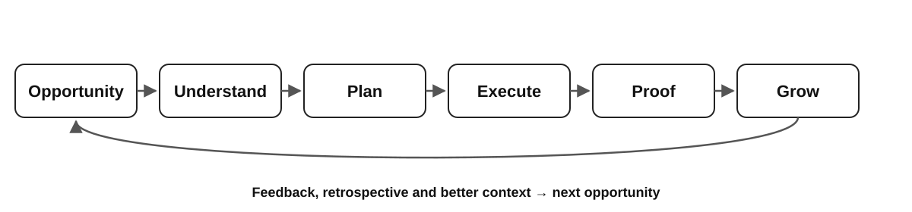

# AI Orchestration Framework

> **Transform Opportunity into Outcomes.**

An open, evidence-based framework for orchestrating AI across business and engineering workflows.

---

## Vision

AI is changing how organizations build software and operate their businesses.

The challenge is no longer simply generating code or automating tasks. The challenge is turning distributed human and AI capability into coherent, measurable outcomes.

The AI Orchestration Framework provides a simple lifecycle for doing that reliably and repeatedly.

---

## Core Orchestration Lifecycle



> **Opportunity → Understand → Plan → Execute → Proof → Grow**

The lifecycle is intentionally simple. The complexity belongs in the context, ownership, evidence, and feedback surrounding each stage—not in adding more stages.

- **Opportunity** — identify the problem or outcome worth pursuing.
- **Understand** — establish sufficient context before acting; retrieve missing context from available organizational knowledge and systems.
- **Plan** — choose the focused path, boundaries, dependencies, and ownership.
- **Execute** — perform the work with explicit ownership across humans and AI.
- **Proof** — demonstrate that the intended outcome actually happened with concrete evidence.
- **Grow** — capture feedback, retrospective learning, and new context so the next cycle starts stronger.

The lifecycle continuously loops as learning creates better context and new opportunities.

---

## Why this Framework?

This framework helps organizations:

* Discover opportunities where AI creates measurable value.
* Build understanding before execution.
* Orchestrate humans and AI with clear ownership.
* Validate outcomes instead of outputs.
* Continuously improve through evidence, feedback, and learning.

---

## Reference Implementations

Practical patterns teams can adopt and adapt directly:

- **[Cross-Team Knowledge Access](docs/reference-implementations.md#1-cross-team-knowledge-access)** — make existing organizational knowledge directly accessible through AI instead of unnecessary cross-team coordination.
- **[Production Exception Remediation](docs/reference-implementations.md#2-production-exception-remediation)** — orchestrate an exception from understanding through fix, evidence, human approval, production verification, and learning.

These are applications of the core lifecycle, not separate frameworks.

---

## Start Here

📖 [Vision](docs/01-problem.md)

📖 [Philosophy](docs/02-philosophy.md)

📖 [Principles](docs/03-principles.md)

📖 [AI Orchestration Model](docs/04-framework.md)

📖 [Reference Implementations](docs/reference-implementations.md)

📖 [Practices & Field Lessons](docs/field-practices.md)

📖 [Case Studies](case-studies/)

📖 Enterprise Adoption *(Coming Soon)*

---

## Repository Structure

```
docs/
case-studies/
diagrams/
templates/
examples/
```

---

## Current Status

**Version 0.2.0** — Evidence & Field Practices

* ✅ AI Orchestration Model
* ✅ Opportunity → Understand → Plan → Execute → Proof → Grow lifecycle
* ✅ Philosophy
* ✅ Principles
* ✅ Reference Implementations
* ✅ Real-World Engineering Case Studies (2)
* ✅ Practices & Field Lessons
* ⏳ Enterprise Adoption Guide

---

## Guiding Principle

> **AI is another engineering capability that must be orchestrated like any other part of a software system.**

The goal is not to maximize AI activity. It is to turn capability into coherent outcomes through context, focus, ownership, evidence, and learning.

---

## Author

**Santhosh Narayanan**

GitHub: https://github.com/santhoshsathish94/ai-orchestration-framework

Built from real-world engineering experience and continuously evolving through evidence-based case studies.
