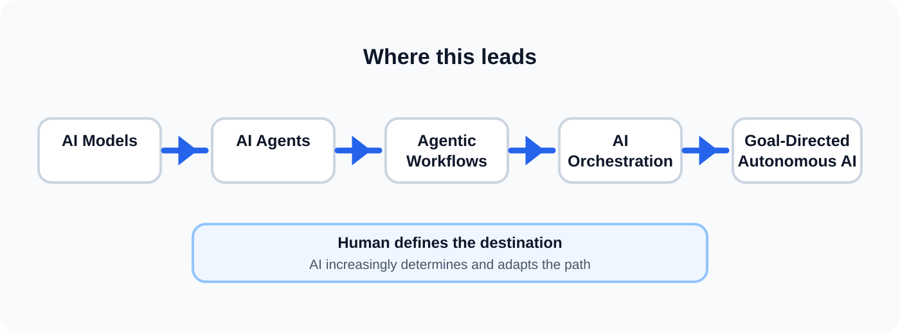

# AI Orchestration Framework

> **Transform Opportunity into Outcomes.**

An open, evidence-based framework for orchestrating AI across engineering and business workflows.

It sits **on top of the systems you already run**. Nothing to install. Nothing to migrate onto.

**[🌐 Read it on the website →](https://santhoshsathish94.github.io/ai-orchestration-framework/)** — the framework explained in about three minutes, with the lifecycle, the evidence ladder, and the autonomy ladder made interactive.

---

## Start

**1. Copy [`AGENTS.md`](AGENTS.md) into your project.**
It is the entire operating model in one file. Point your AI agent at it — it does not need anything else.

**2. Give the agent access to the evidence.**
Repository, tickets, logs, datasources, a non-production environment. Read-only first, one connection
at a time. [How to set that up →](docs/orchestration-environment.md#building-one)

**3. Run one real problem through the loop.**
A defect, a recurring exception, a question nobody can answer quickly. Keep a context file beside the
code so the next cycle starts ahead of this one.

That is the adoption path. Everything below explains why it is shaped this way.

---

## What is it?

The **AI Orchestration Framework is an operating model for turning human intent and AI capability into measurable outcomes through context, execution, evidence, and learning.**

It is not an LLM framework, agent SDK, or prompt library. It defines **how AI and humans work together to achieve an outcome**.

### It sits on top of what you already run

**Orchestration is a layer above your existing systems, not a change to them.** The work already
happens somewhere — repositories, tickets, pipelines, logs, data stores. Orchestration adds the layer
that carries context, execution, evidence and learning across them. What changes is how the work is
directed, not what it runs on.

So adoption is incremental and reversible. Start with one problem; stop whenever you like and the
systems underneath are untouched.

It is not free, though. The layer needs **access**, scoped deliberately — read-only where reading is
enough, human approval wherever the blast radius is real.

### What it is not

- **Not software.** There is nothing to install. It is a way of working.
- **Not a runtime.** It defines the operating model around AI orchestration; it does not prescribe the runtime used to execute it. Agent frameworks, workflow engines and tool protocols are choices that sit inside it, not competitors to it.
- **Not a replacement for how you already work.** It sits alongside Agile, incident management, or whatever your team already uses — and on top of the systems you already run, rather than in place of them.
- **Not about model or tool selection.** It does not tell you which AI to use, and it does not cover cost, evaluations, data governance, or security review.
- **Not needed for everything.** Throwaway or trivial work does not need a lifecycle. Use it where being wrong actually costs something.

### Why orchestration?

AI is evolving:

**AI Models → AI Agents → Agentic Workflows → AI Orchestration**

AI models provide intelligence. Agents can perform tasks. Workflows can repeat tasks. **Orchestration connects context, decisions, execution, proof, and learning so the system can improve over time.**

> **Agentic workflows repeat. Orchestration learns.**

---

## Core Lifecycle

**Opportunity → Understand → Plan → Execute → Proof → Grow**

One principle per stage — if you remember the lifecycle, you remember the principles.

**Opportunity** — Define the problem, why it matters, and the outcome worth pursuing.  
*Start with the opportunity, not the tool.*

**Understand** — Establish the context and evidence needed to decide well.  
*Never assume the context is sufficient.*

**Plan** — Choose the focused path, boundaries, dependencies, and ownership.  
*Parallelize only what is genuinely independent.*

**Execute** — Do the work, adapting when new evidence changes the direction.  
*Delegation never dissolves accountability.*

**Proof** — Demonstrate with evidence that the intended outcome actually happened.  
*Prove outcomes, not activity.*

**Grow** — Capture what was learned and feed it into the next cycle.  
*Only validated experience becomes expertise.*

The lifecycle stays deliberately simple. Experience and expertise are **part of Grow**, not additional stages.

> **Execute produces experience. Grow turns validated experience into expertise.**

[Read the full lifecycle and stage definitions →](docs/04-framework.md) · [Read the principles →](docs/03-principles.md)

---

## Proven in practice

This comes out of delivery work, not theory. Two cycles are documented end to end:

**A CMS content API migration estimated at 8–10 weeks of team effort, delivered in about a day.**
GraphQL → REST and .NET 9 MVC → .NET 10 Minimal APIs, replacing ~7,800 lines across 200+ files —
with every route, JSON shape and response envelope preserved so no consumer had to change, and parity
validated byte-for-byte against live traffic in preprod. The production cutover has not yet run, so
this reaches rung 4 — measured before and after — not rung 5.
[Read the case study →](case-studies/01-contentful-migration.md)

**A production memory leak fixed at its root, not worked around.**
Recurring out-of-memory crashes were stabilized with a blunt mitigation, then the investigation
continued — past the workaround, into React's Server Components renderer. The one-file fix was
contributed upstream so other applications need not carry the same workaround.
[Read the case study →](case-studies/02-react-rsc-memory-leak.md) *(CI-green PR awaiting maintainer review)*

Both left reusable context behind. That is the difference between a workflow that repeats and
orchestration that learns.

---

## Where this leads

AI orchestration is the **foundation**, not the end state.

As reasoning, tools, persistent context, experience, validation, and trust mature, the framework is intended to support a progression toward **goal-directed autonomous AI**.

Today, humans often provide both the goal and the path. Over time, the goal can become the primary human input, while AI increasingly determines and adapts the path within defined constraints and success criteria.

> **Human defines the destination. AI determines and continuously adapts the path.**

The framework does not claim unrestricted autonomy exists today. It defines the engineering foundation through which greater autonomy can progressively become possible — one level at a time, each earned through proof.

[Read the autonomy ladder →](docs/04-framework.md#the-autonomy-ladder)

---

## Why this matters

The framework is designed to help teams:

- Apply AI to meaningful outcomes rather than isolated tasks.
- Reduce missing context and unnecessary coordination.
- Combine humans, AI agents, tools, and enterprise systems coherently.
- Prove that changes actually achieved the intended result.
- Build organizational experience and expertise over repeated executions.
- Create a path from today's agentic systems toward increasingly goal-directed AI.

---

## Reference Implementations

- **[Cross-Team Knowledge Access](docs/reference-implementations.md#1-cross-team-knowledge-access)** — make existing organizational knowledge accessible through AI.
- **[Production Exception Remediation](docs/reference-implementations.md#2-production-exception-remediation)** — take a production issue from understanding through fix, proof, and learning.
- **[Multi-Repository Defect Remediation](docs/reference-implementations.md#3-multi-repository-defect-remediation)** — work a batch of defects across service boundaries, ending in evidence of which are genuinely closed.

These are practical applications of the core lifecycle. Both have been **built and demonstrated
against real organizational data**, not just proposed — though neither has been put in front of end
users yet, and the page says exactly that.

---

## Explore the Framework

**Start here**

- 🌐 [**Website**](https://santhoshsathish94.github.io/ai-orchestration-framework/) — the interactive walkthrough
- 🚀 [**Quickstart**](QUICKSTART.md) — run your first cycle in about 15 minutes
- 🤖 [**AGENTS.md**](AGENTS.md) — the whole operating model as instructions for an AI agent. Point your agent at this one file; it does not need the rest.
- 📝 [Orchestration Brief template](templates/orchestration-brief.md) — the one-page working artifact
- 🧪 [Worked example](examples/production-exception-remediation/) — all six stages on a production `500`

**The framework**

- 📖 [The Problem](docs/01-problem.md) — why another framework
- 📖 [Philosophy](docs/02-philosophy.md) — what it believes
- 📖 [Principles](docs/03-principles.md) — one per stage
- 📖 [AI Orchestration Model](docs/04-framework.md) — the six stages, the evidence ladder, the autonomy ladder

**Going deeper on each part**

- 📖 [Context Engineering](docs/05-context-engineering.md) — the limiting factor, and where persistent context files live
- 📖 [Proof](docs/07-proof.md) — how strong your evidence actually is
- 📖 [Governance](docs/08-governance.md) — ownership, access, attribution, and the monitoring gap
- 📖 [Adoption](docs/09-adoption.md) — turning individual skill into collective capability
- 📖 [Roadmap](docs/10-roadmap.md) — what is coming

**Putting it to work**

- 📖 [The Orchestration Environment](docs/orchestration-environment.md) — the access layer, and how to build one
- 📖 [Reference Implementations](docs/reference-implementations.md) — three patterns, each graded
- 📖 [How AI Fails — and which stage catches it](docs/how-ai-fails.md)
- 📖 [Practices & Field Lessons](docs/field-practices.md) — including the ones that went badly
- 📖 [Case Studies](case-studies/)
- 📖 [Glossary](docs/glossary.md)

**Beyond the framework**

- 🔭 [The AI Future](hypothesis/ai-future.md) — a separate, speculative hypothesis on the race to autonomy. Not part of the framework.
- 🤝 [Contributing](CONTRIBUTING.md)

---

## Current Status

**Latest release: v0.4.0**

- ✅ Core AI Orchestration Lifecycle
- ✅ Principles, one per stage
- ✅ Interactive website on GitHub Pages
- ✅ Quickstart, brief template, and worked example
- ✅ Experience & Expertise within Grow
- ✅ Evidence ladder and autonomy ladder
- ✅ Reference Implementations
- ✅ Real-World Case Studies (3) — two with delivered outcomes
- ✅ How AI Fails, Field Lessons, Glossary
- ⏳ Enterprise Adoption Guide

---

## Guiding Principle

> **AI is another engineering capability that must be orchestrated like any other part of a software system.**

The goal is not to maximize AI activity. It is to turn capability into coherent outcomes through **context, focus, ownership, evidence, and learning**.

## Contributing

This is an open, feedback-driven project. Contributions and honest feedback are welcome. See [CONTRIBUTING.md](CONTRIBUTING.md).

## Author

**Santhosh Narayanan**

Built from real-world engineering experience and continuously evolving through evidence-based case studies.
