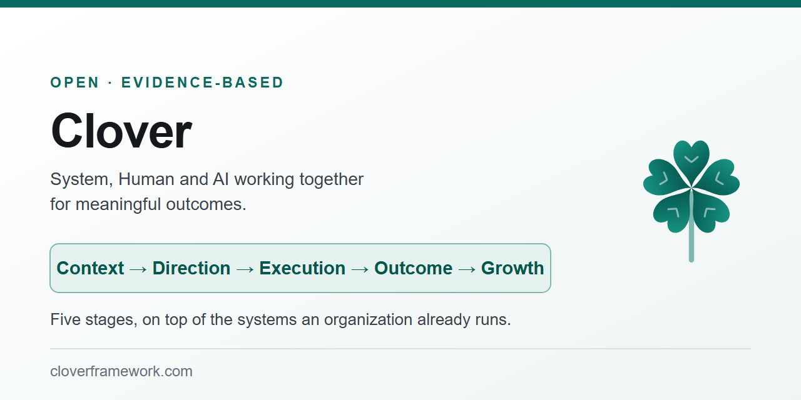

  

  <a href="https://cloverframework.com/"><strong>cloverframework.com</strong></a> ·
  <a href="QUICKSTART.md">Quickstart</a> ·
  <a href="AGENTS.md">AGENTS.md</a> ·
  <a href="docs/04-framework.md">The framework</a> ·
  <a href="docs/glossary.md">Glossary</a>

---

Clover is an AI Orchestration Framework connecting real-world Context, human Direction, AI-driven
Action, and validated Success into a repeatable cycle. It sits on top of the systems a team already
runs, so there is nothing to install and nothing to migrate onto.

This page is the map. The website tells the story, the docs hold the detail, and both are linked from
here.

---

## The short story

AI grew from finishing the line you were typing to working through a whole task on its own. The same
tool now reasons like a developer, an operator, a security reviewer, a tester and an analyst, and
covering that range would normally take several people.

The way we use it has not moved with it. A human gives the Direction, AI takes the Action, and
somebody checks for Success. Three stages, and that same human also supplies the context — they
remember which service is involved, they paste in the error, they attach the file, they explain what
was tried last month. AI only ever sees the part of the system that one human thought to describe.

That was a fair trade when AI could handle one small job. The context is already sitting in the
systems the organization runs, and AI can read those systems directly, so Context becomes a stage of
its own and it goes first. Direction stays human, and it stops describing the problem from memory and
starts pointing at the part of the system worth reading first.

It runs in a loop, and what comes back from one pass is context for the next. Markdown files kept
beside the work hold the summary, and that summary is what lets any agent pick the job up, so no
single agent has to hold the work.

**[Read the whole story on the website →](https://cloverframework.com/)** — about three minutes.

---

## The four stages

The stages read in the order the work runs in.

| Stage | What it covers | The question it answers |
|---|---|---|
| **Context** | The current systems the organization uses — repositories and their projects and documentation, datasources, logs and telemetry, deployment environments, running applications | What do we need to know about reality before acting? |
| **Direction** | The human controls what matters, the desired outcome, constraints, boundaries, and what must not happen, and approves | What needs to be done, and what must not happen? |
| **Action** | AI determines how the work should happen and executes within those boundaries | What should we do, and how should the work happen? |
| **Success** | The intended outcome demonstrated by the real environment | Did reality validate the intended outcome? |

Each stage has one job. If Success does not hold, the cycle goes back to Context rather than to
Action, because a second attempt on the same information lands in the same place, faster.

---

## Start

**1. Copy [`AGENTS.md`](AGENTS.md) into your project.**
It is the whole way of working written as instructions for an agent. Point an agent at that one file
and nothing else is required.

**2. Connect the Context stage.**
Read-only MCP servers in front of the repositories, the tickets, the logs and the datasources, plus
one environment to read — development is enough. Scope every connection to what the human driving the
work can already read, at the privileges they already hold.

**3. Run one real problem through the four stages.**
A defect, a recurring exception, a question nobody can answer quickly. Say where you think the answer
is, and keep a markdown file beside the code so the next cycle starts ahead of this one.

Adoption is incremental and reversible, and a team that stops is left with the systems it already had.

[Quickstart](QUICKSTART.md) · [Brief template](templates/orchestration-brief.md) ·
[Worked example](examples/production-exception-remediation/) ·
[Setting up the environment](docs/orchestration-environment.md#building-one)

---

## The framework

| | |
|---|---|
| [The problem](docs/01-problem.md) | What the framework exists to fix |
| [Philosophy](docs/02-philosophy.md) | The thinking underneath the four stages |
| [Principles](docs/03-principles.md) | What makes each stage hold up on real work |
| [The framework in full](docs/04-framework.md) | The four stages, and the arc from three leaves to five |
| [Context](docs/05-context-engineering.md) | The first stage: what has to be known about reality before anything acts |
| [Success](docs/07-success.md) | The last stage: whether the environment confirms the outcome |
| [Governance](docs/08-governance.md) | Ownership, access and attribution as the cycle scales, and [the questions a security team will ask](docs/08-governance.md#questions-your-security-team-will-ask) |
| [Adoption](docs/09-adoption.md) | How a team gets there, and [how much autonomy to grant](docs/08-governance.md#how-much-autonomy-to-grant) |
| [Roadmap](docs/10-roadmap.md) | Where it is going, held loosely |
| [The name and the mark](docs/clover-origin.md) | Why a clover, and the canonical definition |

Every document in [`docs/`](docs/) is indexed there, including the ones this table does not list.

---

## Putting it to work

| | |
|---|---|
| [AGENTS.md](AGENTS.md) | The whole framework as operating instructions for an agent |
| [Quickstart](QUICKSTART.md) | A first cycle on a real task, in about fifteen minutes |
| [The orchestration environment](docs/orchestration-environment.md) | What has to be in place before any of it runs |
| [Reference implementations](docs/reference-implementations.md) | [Cross-team knowledge access](docs/reference-implementations.md#1-cross-team-knowledge-access), [production exception remediation](docs/reference-implementations.md#2-production-exception-remediation), [multi-repository defect remediation](docs/reference-implementations.md#3-multi-repository-defect-remediation) |
| [Orchestration brief](templates/orchestration-brief.md) | The template a cycle starts from |
| [Worked example](examples/production-exception-remediation/) | One cycle, start to finish |

---

## Evidence and lessons

Two cycles are written up end to end, including the parts that are still unproven.

| | |
|---|---|
| [Contentful API migration](case-studies/01-contentful-migration.md) | ~7,800 lines across 200+ files, GraphQL → REST and .NET 9 MVC → .NET 10 Minimal APIs, with every route and JSON shape preserved. Implementation took about a day against an 8–10 week estimate, and QA signed off on parity across 36 endpoint cases. **The production cutover has not run.** |
| [A React Server Components memory leak](case-studies/02-react-rsc-memory-leak.md) | Recurring out-of-memory crashes stabilized with a Node flag, then traced past the workaround into React's renderer. The one-file fix went upstream as a CI-green pull request, which **has not been merged.** |
| [How AI fails](docs/how-ai-fails.md) | The failures specific to working this way, and which stage catches each one |
| [Practices and field lessons](docs/field-practices.md) | What running this on high-stakes work actually taught |
| [Glossary](docs/glossary.md) | Plain-language definitions for every term used here |

The reference implementations have all been built and used against real organizational data. None is
always-on or adopted organization-wide, and each depends on a human providing the map and holding the
approvals.

---

## What it is not

- **Not software.** There is nothing to install.
- **Not a runtime.** Clover defines the way of working around AI orchestration and does not prescribe
  what executes it. Agent frameworks, workflow engines and tool protocols sit inside it.
- **Not a replacement for how a team already works.** It runs alongside Agile, incident management,
  or whatever is already in place.
- **Not about AI model or tool selection.** It does not say which AI to use, and it does not cover
  cost, evaluations, data governance, or security review.
- **Not needed for everything.** Throwaway work does not need a cycle. It is worth the effort where
  being wrong costs something.

---

## Contributing

Corrections, questions and case studies are welcome, including the ones where the outcome was never
reached. See [CONTRIBUTING.md](CONTRIBUTING.md), and [CHANGELOG.md](CHANGELOG.md) for what has
changed.

[The AI Future](hypothesis/ai-future.md) is a separate hypothesis about where this goes. It is
speculative and labeled as such.

## Author

**Santhosh Narayanan**

Clover comes out of real engineering work, and it keeps changing as more of that work gets done.

Licensed under [CC BY 4.0](LICENSE).
