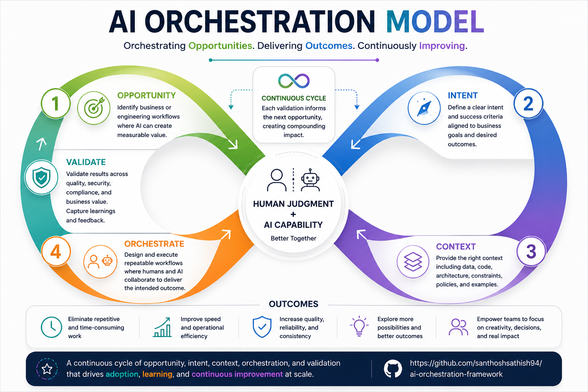

# AI Orchestration Framework

> **Transform Intent into Outcomes.**

An open, evidence-based framework for orchestrating AI across business and engineering workflows.

---

## Vision

AI is changing how organizations build software and operate their businesses.

The challenge is no longer generating code or automating tasks.

The challenge is integrating AI into existing workflows in a way that is reliable, measurable, and repeatable.

The AI Orchestration Framework provides a structured approach to achieve that goal.

---

## AI Orchestration Model



---

## Why this Framework?

This framework helps organizations:

* Discover opportunities where AI creates measurable value.
* Transform intent into engineering context.
* Orchestrate AI within business and engineering workflows.
* Validate outcomes instead of outputs.
* Continuously improve through feedback and learning.

---

## Start Here

📖 [Vision](docs/01-problem.md)

📖 [Philosophy](docs/02-philosophy.md)

📖 [Principles](docs/03-principles.md)

📖 [AI Orchestration Model](docs/04-framework.md)

📖 [Case Studies](case-studies/)

📖 Enterprise Adoption *(Coming Soon)*

---

## Repository Structure

```
docs/
case-studies/
diagrams/
templates/
examples/
```

---

## Current Status

🚧 **Version 0.1** — Foundation

* ✅ AI Orchestration Model
* ✅ Philosophy
* ✅ Principles
* 🚧 First Production Case Study
* ⏳ Enterprise Adoption Guide

---

## Guiding Principle

> **AI is another engineering capability that must be orchestrated like any other part of a software system.**

---

## Author

**Santhosh Narayanan**

GitHub: https://github.com/santhoshsathish94/ai-orchestration-framework

Built from real-world engineering experience and continuously evolving through production case studies.
