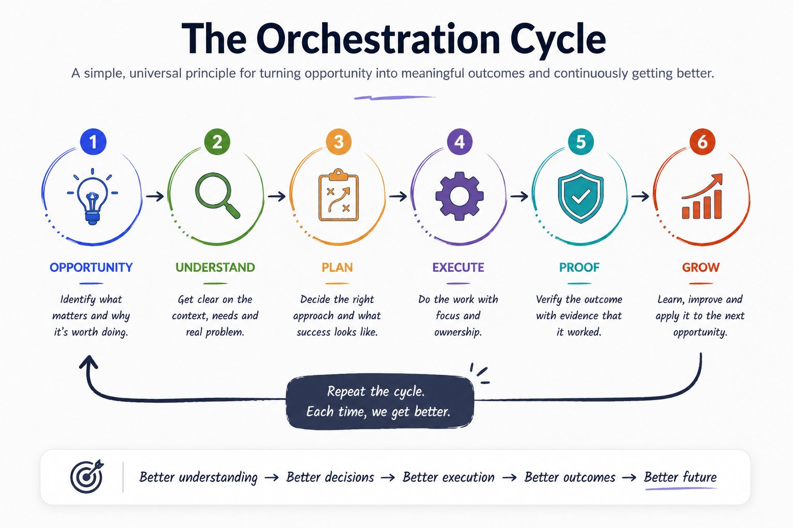

# AI Orchestration Framework

> **Transform Opportunity into Outcomes.**

An open, evidence-based framework for orchestrating AI across business and engineering workflows.

---

## What is the AI Orchestration Framework?

The **AI Orchestration Framework is an operating model for turning human intent and AI capability into measurable outcomes through context, structured execution, evidence, and continuous learning.**

It is technology independent. It can be implemented using different AI models, agents, tools, enterprise systems, and human workflows.

It is **not** an LLM framework, agent SDK, or prompt library. It defines how humans and AI work together across a complete outcome-oriented workflow — from understanding an opportunity through execution, proof, and learning.

---

## Vision

AI is changing how organizations build software and operate their businesses.

The challenge is no longer simply generating code or automating tasks. The challenge is turning distributed human and AI capability into coherent, measurable outcomes.

The AI Orchestration Framework provides a simple lifecycle for doing that reliably and repeatedly.

---

## Core Philosophy

AI is making the barriers to entering new fields of expertise thinner.

What once required years of accumulated knowledge, large teams, and specialized expertise can increasingly be approached with clear intent and expectations, while AI helps us understand, reason, evaluate, and iterate along the way.

AI does not eliminate expertise. It makes expertise more accessible.

It can also help reduce the gaps that naturally occur in human decision-making — identifying missing information, surfacing overlooked signals, and providing evidence that an outcome actually works.

> **AI expands what humans can understand, reduces what humans can miss, and helps prove what humans accomplish.**

This is why the framework focuses on orchestration rather than simply prompting. The goal is to move from intent through context, reasoning, execution, evaluation, and proof while keeping consequential decisions with the appropriate human expert.

---

## Core Orchestration Lifecycle



> **Opportunity → Understand → Plan → Execute → Proof → Grow**

The lifecycle is intentionally simple. The complexity belongs in the context, ownership, evidence, and feedback surrounding each stage—not in adding more stages.

- **Opportunity** — identify the problem or outcome worth pursuing.
- **Understand** — establish sufficient context before acting; retrieve missing context from available organizational knowledge and systems.
- **Plan** — choose the focused path, boundaries, dependencies, and ownership.
- **Execute** — perform the work with explicit ownership across humans and AI.
- **Proof** — demonstrate that the intended outcome actually happened with concrete evidence.
- **Grow** — capture feedback, retrospective learning, and new context so the next cycle starts stronger.

The lifecycle continuously loops as learning creates better context and new opportunities.

---

## Why this Framework?

This framework helps organizations:

* Discover opportunities where AI creates measurable value.
* Build understanding before execution.
* Orchestrate humans and AI with clear ownership.
* Identify missing context and reduce blind spots.
* Prove outcomes, not activity.
* Continuously improve through evidence, feedback, and learning.

---

## Reference Implementations

Practical patterns teams can adopt and adapt directly:

- **[Cross-Team Knowledge Access](docs/reference-implementations.md#1-cross-team-knowledge-access)** — make existing organizational knowledge directly accessible through AI instead of unnecessary cross-team coordination.
- **[Production Exception Remediation](docs/reference-implementations.md#2-production-exception-remediation)** — orchestrate an exception from understanding through fix, evidence, human approval, production verification, and learning.

These are applications of the core lifecycle, not separate frameworks.

---

## Start Here

🚀 [**Quickstart**](QUICKSTART.md) — apply the lifecycle to your first task in ~15 minutes

📖 [Vision](docs/01-problem.md)

📖 [Philosophy](docs/02-philosophy.md)

📖 [Principles](docs/03-principles.md)

📖 [AI Orchestration Model](docs/04-framework.md)

📖 [Reference Implementations](docs/reference-implementations.md)

📖 [Practices & Field Lessons](docs/field-practices.md)

📖 [Case Studies](case-studies/)

📖 [Contributing](CONTRIBUTING.md)

📖 Enterprise Adoption *(Coming Soon)*

---

## Repository Structure

```
docs/
case-studies/
diagrams/
templates/
examples/
```

---

## Current Status

**Version 0.3.0 (in progress)**

* ✅ AI Orchestration Model — Opportunity → Understand → Plan → Execute → Proof → Grow
* ✅ Philosophy
* ✅ Principles
* ✅ Reference Implementations
* ✅ Real-World Case Studies (3)
* ✅ Practices & Field Lessons
* ✅ Contributing guide (open to feedback)
* ✅ Quickstart and first runnable example (Production Exception Remediation)
* ⏳ Enterprise Adoption Guide

---

## Guiding Principle

> **AI is another engineering capability that must be orchestrated like any other part of a software system.**

The goal is not to maximize AI activity. It is to turn capability into coherent outcomes through context, focus, ownership, evidence, and learning.

---

## Contributing

This is an open, feedback-driven project — contributions and honest feedback are welcome. See
[CONTRIBUTING.md](CONTRIBUTING.md) for how to raise an issue or a pull request, and what we look for.

---

## Author

**Santhosh Narayanan**

GitHub: https://github.com/santhoshsathish94/ai-orchestration-framework

Built from real-world engineering experience and continuously evolving through evidence-based case studies.
