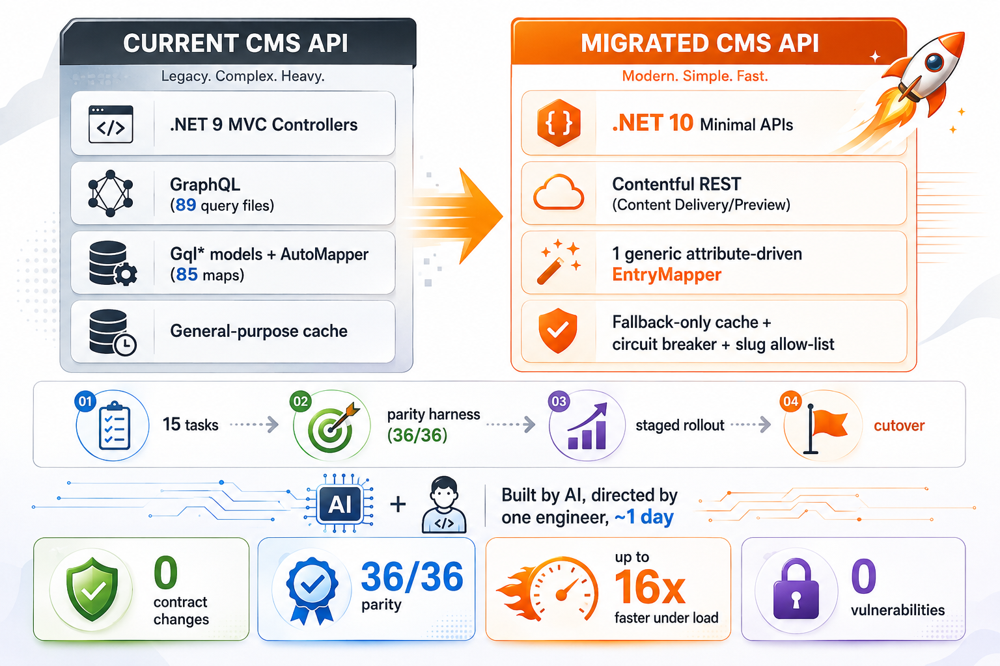

# Contentful API Migration

**Current CMS API (GraphQL) → Migrated CMS API (REST)** · .NET 9 MVC → .NET 10 Minimal API
**A large migration made far more achievable — and much faster — with AI.**

## Summary

The CMS content API that powers the company's public website (pages, sections, blog, help center,
glossary) was rewritten from the ground up: from a GraphQL integration against Contentful to a REST (Content
Delivery/Preview API) integration, and from .NET 9 MVC controllers to .NET 10 Minimal APIs. The
public contract — every route, JSON shape, and response envelope — was preserved exactly, so no
consumer (the website, and anything else calling the API) needed to change. AI carried most of the
rewrite; the work still needed human judgment to set direction and to independently verify each
result against real, running systems. Both versions were deployed to UAT and the API gateway's
preprod endpoint was pointed at the new one, so **QA validated the real site against the migrated
API and signed it off**. What stands out is not who wrote the code — it is how much AI lowered the
barrier.

> **On "a day."** The **implementation** took about a day, run with agents and subagents. Testing and
> parity validation took roughly another day on top of that, and getting stakeholder agreement took
> longer still. The work was not continuous, and the calendar time from start to sign-off was
> materially longer than the execution time. The one-day figure describes **execution only** — it is
> not an end-to-end delivery time, and comparing it directly against an 8–10 week estimate that
> included analysis, review and coordination would overstate the gain.

> **What this is proven against.** The parity harness and QA's sign-off against the real site through
> the gateway. Not the performance figures, which were measured locally (see Results). The production
> cutover has not yet run, so nothing here claims the migration has been observed under real traffic.
> The staged rollout below is the plan the evidence supports, not a sequence that has already
> executed.

## Contentful migration model

## Why we migrated

- **The GraphQL integration was heavy and brittle.** ~7,800 lines across 200+ files of hand-written,
  content-type-specific glue — `Gql*` models and converters, a 1,246-line AutoMapper profile, a
  bespoke rich-text link resolver, a dynamic query builder, and 89 `.graphql` query/fragment files —
  all had to be kept in lockstep by hand every time a content type changed.
- **A recent denial-of-service incident** hammered the API with random, invalid slugs; the Current
  CMS API's architecture had no purpose-built defense against that pattern.
- **Caching was a general-purpose layer, not a deliberate safety net.** Contentful's CDN is already
  fast; the cache only needed to exist as a last-known-good fallback for outages, not a read-through
  layer adding its own complexity and staleness risk.
- **Observability was thin** — failures surfaced through customer reports more often than through
  metrics or alerts.
- **The stack was aging.** .NET 9 plus a hand-rolled GraphQL client was slower under load and harder
  to extend than a modern Minimal API stack.
- **A manual rewrite was estimated at 8–10 weeks of team effort.** The goal was to see whether AI,
  handling the implementation under close human direction and verification, could deliver the same
  result safely in a fraction of the time — lowering the barrier to the work, not proving any one
  person's or tool's prowess.

## What changed

| | Before — Current CMS API | After — Migrated CMS API |
|---|---|---|
| Runtime | .NET 9, MVC controllers | .NET 10, Minimal APIs |
| Contentful access | GraphQL, 89 `.graphql` files, 2–3 round trips | REST Content Delivery/Preview API, 1 fetch + `include` |
| Mapping | 99 `Gql*` models + AutoMapper (85 hand-written maps) | 1 generic, attribute-driven `EntryMapper` (cached plans) |
| Caching | General-purpose cache | Fallback-only (fire-and-forget, circuit breaker, single-flight) |
| Abuse defense | None | Slug allow-list + Contentful webhook (unknown slugs rejected before any Contentful call) |
| Observability | Minimal | OpenTelemetry → Application Insights |
| Public API | 5 endpoint groups, versioned routes | **Identical** — same routes, same JSON, same envelope |

## How we did it

AI carried most of the implementation below; the work still needed human judgment to set direction,
make the calls, and independently verify each result against real, running systems before trusting
it. The takeaway is not the split of labor — it is that AI made a migration this size approachable in
a fraction of the usual effort.

1. **Locked one non-negotiable rule:** the public contract (routes, DTO shapes, `CMSAPIResponse`
   envelope, JSON casing) could not change. Every other decision was subordinate to this.
2. **Replaced per-type hand-written mapping with one generic engine.** A reflection-based
   `EntryMapper` (compiled plans cached per type) driven entirely by attributes (`[ContentType]`,
   `[ContentfulField]`, `[RichText]`, `[Collection]`, …) replaced the 99 `Gql*` converters and the
   AutoMapper profile — a content-model change is now a DTO-attribute edit, not a new converter.
3. **Broke the rewrite into 15 small, independently-verifiable tasks** (foundation → DTO contracts →
   5 content domains → caching/resilience gateway → DoS allow-list/webhook → observability →
   validation harness → hosting/cutover → performance → payload optimization), each built,
   unit-tested, and merged only after an independent build/test check — never one giant rewrite.
4. **Built an objective parity harness as the real gate for correctness**, not manual review: a live
   differ that called the Current CMS API and the Migrated CMS API side by side for every endpoint,
   plus committed contract-snapshot ("golden JSON") tests. The differ was deliberately
   *additive-tolerant* — a new/added field never fails the check, only a removed or changed value
   does, matching how consumers actually break.
5. **Used that harness to find and fix real bugs before go-live**, for example:
   - Response JSON was briefly camelCase (per the original plan) when the Current CMS API's live
     responses were actually PascalCase with nulls included — caught by diffing real responses, fixed
     everywhere.
   - The new slug allow-list reused the sitemap's narrow 2-content-type list to gate *every* page
     lookup, which would have 404'd the homepage, FAQ, and Help Center landing page in production —
     caught via live testing, fixed to cover all 8 page content types.
   - Search was implemented against Contentful's full-text search, which matched far more broadly
     than the Current CMS API's slug/title/category/tag matching — caught by comparing result counts,
     reimplemented to match its behavior exactly.
6. **Validated through the API gateway against the real site, not just at the API boundary.** Both
   versions — current and migrated — were deployed to the UAT environment. The gateway's **preprod
   endpoint was then pointed at the migrated API**, so the actual website ran against the new
   service end to end while the current one stayed live and unchanged for everyone else. **QA tested
   the site directly in that configuration and signed off.** That is the difference between proving
   two JSON responses match and proving the product still works.
7. **Planned the rollout in reversible stages, not a single cutover:** the gateway split above meant
   the migrated API could be exercised under real conditions and reverted by repointing one route.
   A second Contentful webhook kept both services' allow-lists current during the transition, and
   the current API stayed warm and instantly reinstatable for the flip. The production flip itself
   has not yet been performed.
8. **Judgment stayed human** — e.g. deciding which live differences were acceptable improvements vs.
   real regressions. Nothing was accepted on the AI's word alone: each task's code, tests, and live
   behavior were independently checked against the real, running systems before merging, rather than
   trusting generated code or documentation at face value.

## Results

### Correctness and delivery

| Metric | Before | After |
|---|---|---|
| Live parity, Current vs. Migrated CMS API (byte-for-byte) | — | **36/36** endpoint cases (34 exact + 2 explicitly-approved deviations) |
| Endpoint groups verified side-by-side | — | **15/15**, zero errors, zero customer-visible differences |
| Site validated end to end through the API gateway | — | **QA tested the live site against the migrated API and signed off** |
| Automated tests | — | **239/239** passing (220 unit + 19 contract-snapshot), 0 build warnings |
| Security scan | — | 0 vulnerable dependencies, 0 hardcoded secrets, OWASP Top 10 clean |
| Implementation time | — | **~1 day** of execution with agents and subagents |
| Testing and parity validation | — | **~1 further day** |
| Stakeholder review and agreement | — | longer again; work was not continuous |
| Original estimate for the same scope | ~8–10 weeks of team effort | — |

The parity suite was a **one-time migration gate, not a permanent CI check** — it was removed from
the pipeline once it had done its job, because it requires both services running side by side. So
36/36 is a point-in-time result, not a continuously enforced one.

### Performance — and what produced it

**These are local measurements.** Both services were run on one developer machine and driven by a
committed script: warm-up pass, then 400 requests at 40 concurrency across four representative
endpoints, plus a separate 120-request invalid-slug burst. **No load test has been run against
deployed infrastructure.** A proper multi-regime test was written and never executed, and the
comparison report it was meant to populate was never generated. Treat the direction as sound and the
multiples as indicative, not as production figures.

| Metric | Before | After |
|---|---|---|
| Throughput @ 40 concurrent | 7.6 req/s | **48 req/s (~6×)** |
| Help Center listing | 5.6 s | **345 ms (16× faster)** |
| Blog listing | 12.9 s | **1.9 s (6.8× faster)** |
| Typical content page | 667 ms | **189 ms (3.5× faster)** |
| Invalid / unknown-slug requests | ~70 ms (still reached Contentful) | **~8 ms**, rejected before any Contentful call |
| Response payload size | baseline JSON | **~63% smaller on average** (Brotli; up to 85% on the largest page) |

**Credit where it belongs: AI did not make this faster — the new architecture did.** One REST fetch
with `include` instead of 2–3 GraphQL round trips, a slug allow-list that rejects junk before it
reaches Contentful, and Brotli on a payload that had never been compressed. A team writing the same
design by hand would have measured the same gains. What AI changed was the cost of *attempting* the
rewrite at all, which is a claim about effort, not about latency.

## Key takeaways

- **An automated, additive-tolerant parity harness — not manual review — is what made "byte-for-byte
  compatible" a provable claim.** It caught every real regression before customers could.
- **Decoupling the wire contract from the source system** (DTOs plus mapping attributes, independent
  of Contentful's field names) means future content-model changes are a small, low-risk edit instead
  of a new hand-written converter.
- **Small, independently-verifiable steps with a hard build/test gate at each merge** are what let
  AI carry the implementation quickly and safely, with people directing and verifying rather than
  writing the code by hand.
- **AI made this achievable with far less effort than the internal multi-week, multi-person estimate
  assumed.** The limiting factor was having an objective way to verify the changes, not engineering
  headcount — AI lowered the barrier; the parity harness kept it safe.
- **Execution stopped being the expensive part, which moved the bottleneck rather than removing it.**
  Writing the code took a day; proving it was right took another, and getting agreement to ship took
  longer than both. Any honest account of AI speed-up has to say which of those it is talking about.
- **Say where a number was measured, or it will be read as more than it is.** The performance figures
  here come from two processes on one machine. They are real and reproducible, and they are not
  production evidence. "Measured" and "measured somewhere that matters" are different claims.
- **A staged, reversible cutover** (shadow run → dual webhook → gradual flip → warm rollback target)
  means the migration will only ever carry as much production risk as each stage's own evidence justifies.
- The full history is traceable commit-by-commit in this repository's git log.
