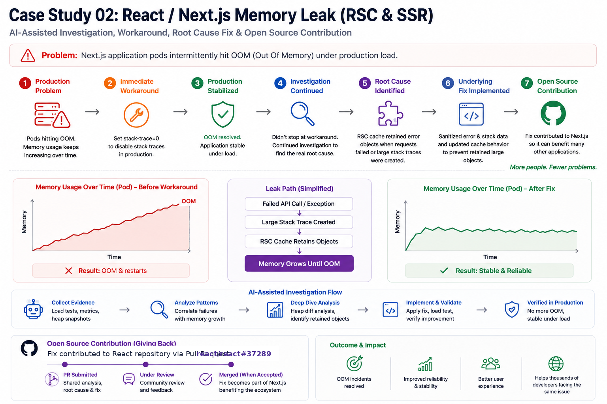

# 02 — Fixing a React Server Components Memory Leak Upstream: Case Study

**Production OOM → workaround → root cause → validated fix → open-source contribution**
**An AI-assisted investigation that did not stop when the production incident was stabilized.**

## Summary

A production Next.js 16 App Router application under real traffic was crashing with out-of-memory
(OOM) errors: server memory grew without bound under sustained load until the process died, causing
recurring production incidents and delaying releases. The immediate mitigation was a blunt workaround — a global Node flag (`NODE_OPTIONS=--stack-trace-limit=0`) that stopped the memory growth but also strips error-stack detail everywhere.

The workaround stabilized production, but the investigation continued. Rather than living with the workaround, the leak was traced to its true source — not in the
application or Next.js's own code, but one layer deeper, in React's Server Components renderer
(`react-server`, the "Flight" server) — and fixed there so every consumer of the library benefits.
AI carried much of the loop: building a minimal reproduction, making the leak measurable, isolating
the mechanism, writing the one-file fix, and drafting the public issue, pull request, and
reproduction repository. That is what made a fix like this practical to attempt at all — it still
took human judgment to set the direction and to check each result against real, measured behavior
before trusting it.

The result is a personal open-source contribution, filed as a **CI-green pull request awaiting maintainer
review — not yet merged**. The goal is broader than fixing one application: if the upstream fix is accepted, other applications using the affected React path can benefit without carrying the same workaround. It resolves the React instance of the anti-pattern; the same pattern exists
at a second site in Next.js, independently reported by another engineer, and is tracked separately.



*The visual is intentionally simple: stabilize the incident, continue the investigation, fix the underlying problem, and give the fix back to the ecosystem.*

## The problem

- **Unbounded server memory → OOM.** Under real traffic the application's memory climbed continuously
  and the process eventually crashed — producing production incidents and release delays. (The
  production impact is qualitative here; the quantitative evidence below comes from a public
  reproduction, not the private app.)
- **The immediate mitigation was blunt.** `NODE_OPTIONS=--stack-trace-limit=0` bounded the growth but
  globally strips stack frames from every error, degrading observability across the whole service.
- **It wasn't only us.** The same symptom is widely reported publicly — e.g. `vercel/next.js#84648`,
  where server memory stays around 15 GB after a 40k-request load test in dynamic-rendering mode, and
  a partial Next.js fix in 16.0.3 did not fully resolve it. The real defect lived deeper than the
  application code.

## The workaround was not the destination

`NODE_OPTIONS=--stack-trace-limit=0` was the practical production mitigation. It stopped the memory growth and restored stability, so it was useful and necessary. But it also globally disabled stack capture, reducing observability for unrelated errors.

That distinction matters to the framework: **mitigate the incident, then keep investigating the cause.** The objective was not simply to make the pods stop crashing; it was to understand why disabling stack capture changed the behavior and determine whether the underlying defect could be fixed without sacrificing stack traces across the application.

## Root cause

The leak is in React's `react-server` (Flight) renderer — `packages/react-server/src/ReactFlightServer.js`.

On **every successful render completion**, the server creates an internal cleanup signal:

- it constructs `new Error('This render completed successfully. All cacheSignals are now aborted ...')`
  and stores it as `cacheController.signal.reason`, held for the entire lifetime of the request;
- that `Error`'s captured **synchronous** stack retains — through its call-sites' closures — the
  completed render's cache scope, which includes the `cache()` fetch-dedupe entries that hold the
  fetch `Response` bodies.

So the response payload of every completed request is pinned in memory by the stack trace of an error
that is never shown to anyone. Under load — especially with clients disconnecting mid-render —
retained heap grows without bound until OOM.

The mechanism was corroborated independently: another engineer diagnosed the **same anti-pattern** —
an `Error` kept as an abort `reason` whose unread `.stack` pins the render's closure graph — at a
**different** code site (Next.js `dynamic-rendering.js`) in `vercel/next.js#97316`. Two independent
diagnoses of the same shape, in two files, are strong evidence the root cause is real rather than an
artifact of one setup. React already limits Flight stack capture elsewhere for exactly this memory
reason (#34864, #37086, #37158), so the fix fits an accepted, existing pattern.

## The fix

The cleanup reason is internal and never surfaced to users, so it does not need a stack trace at all.
Create it with stack capture turned off, then restore the previous limit — one file, **+11 / −0**.

| | Before | After |
|---|---|---|
| Cleanup abort reason | `new Error(...)` with a full synchronous stack | same `Error`, created with `Error.stackTraceLimit = 0` (saved/restored) |
| What the stack pins | the completed render's `cache()` scope + fetch `Response` bodies | nothing — no frames captured |
| Retained heap under load | climbs to OOM | flat |
| Rendered output | full response | **identical** |

```js
// Before — pins the render's cache scope for the request's lifetime
const abortReason = new Error('This render completed successfully. All cacheSignals are now aborted ...');
request.cacheController.abort(abortReason);

// After — benign, never-surfaced reason carries no stack
const previousStackTraceLimit = Error.stackTraceLimit;
Error.stackTraceLimit = 0;
const abortReason = new Error('This render completed successfully. All cacheSignals are now aborted ...');
Error.stackTraceLimit = previousStackTraceLimit;
request.cacheController.abort(abortReason);
```

This fixes the React (`react-server`) instance of the pattern. The Next.js instance
(`vercel/next.js#97316`) is a separate, complementary fix.

## How we did it

AI did much of the legwork below — the reproduction, the analysis, the fix, and the write-ups —
which is what made this quick to do. It still took human judgment to steer the work and to check each
result against real, measured behavior; nothing was accepted on the AI's word. The point is not who
did what, but that AI lowered the barrier enough to make a fix like this practical.

1. **Built a minimal, shareable reproduction.** A `force-dynamic` Server Component that awaits a slow
   upstream fetch and renders a large list, a load generator that disconnects clients mid-render, and
   a GC-probe endpoint to read retained heap on demand.
2. **Made retention measurable, not anecdotal.** Controlled, multi-round runs that measure retained
   heap after a **forced GC** each round — turning "it leaks" into a repeatable before/after number.
3. **Formed and tested hypotheses until the mechanism was isolated.** Proved that only
   `--stack-trace-limit=0` (which disables **synchronous** frame capture) eliminated the growth, while
   `--no-async-stack-traces` did not — pinning the cause to synchronous stack capture. Confirmed with
   heap-snapshot retainer analysis showing retained `_Response` objects tracing back to the `cache()`
   dedupe map.
4. **Implemented the one-file fix** — create the never-surfaced cleanup reason with
   `Error.stackTraceLimit = 0` (save/restore) so it carries no stack.
5. **Authored the public issue, pull request, and reproduction repo** — forked, branched, committed,
   and pushed under a personal identity, and signed the contributor license agreement — all isolated
   from work identity and tooling.
6. **Did prior-art due diligence.** Searched both repositories, found the public symptom hub and the
   independent diagnosis of the same mechanism, deliberately avoided filing a duplicate, and
   cross-linked everything so the community can connect the reports, the repro, and the fix.
7. **Kept the judgment human.** Each claim — root cause, mechanism, fix efficacy — was checked
   against real, measured behavior before it was trusted, rather than accepting generated code or
   explanations at face value.

The loop mirrors the framework's model end to end: **Opportunity** (a production incident worth
fixing at the root) → **Understand** (reproduce the leak, isolate the mechanism, gather evidence) →
**Plan** (a focused one-file fix and the upstream contribution path) → **Execute** (implement the
fix; open the issue, PR, and reproduction) → **Proof** (measured, repeatable heap evidence, plus
independent corroboration) → **Grow** (a reusable upstream fix and lessons captured) — iterated
until proven.

## Results

| Metric | Before | After |
|---|---|---|
| Retained heap after forced GC (round 1) | 542 MB | ~68 MB |
| Retained heap, sustained | climbs 1141 → 1111 → 1615 MB → OOM | ~68–94 MB, flat over 8 rounds (160k reqs) |
| Rendered output | full 2000-item list, HTTP 200 | identical |
| Mechanism isolation | — | only `--stack-trace-limit=0` fixes it (synchronous frames) |
| Fix size | — | 1 file, +11 / −0 |
| Independent corroboration | — | matching production diagnosis (`vercel/next.js#97316`) |
| Status | production mitigated via a global Node flag | upstream fix filed, CI-green, in review |

## Key takeaways

- **A measurable, repeatable harness turned "it leaks" into a provable before/after.** Multi-round
  retained-heap-after-GC is the same "prove the outcome, not just the output" principle as case study 01 —
  applied to memory instead of API parity.
- **AI can carry much of the investigation-to-PR loop** — reproduction → hypotheses → heap analysis →
  patch → upstream authoring — with people setting direction and validating each step. The value is
  the lowered barrier to making this kind of contribution, not replacing engineering judgment.
- **A workaround resolves an incident; root-cause analysis can resolve a class of problems.** The production mitigation stabilized the application, but continuing the investigation enabled an upstream fix that can benefit other consumers of the affected React path.
- **Independent corroboration** — another engineer's production heap-snapshot diagnosis of the same
  anti-pattern at a different site — is strong evidence the root cause is real, not a quirk of one
  environment.
- **Prior-art due diligence is part of orchestrating a good contribution:** don't duplicate,
  cross-link the existing reports, and provide the missing reproduction that ties them together.

## Public artifacts

- React issue: https://github.com/react/react/issues/37288
- React fix PR: https://github.com/react/react/pull/37289
- Reproduction repo: https://github.com/santhoshsathish94/react-flight-oom-repro
- Community reports: `vercel/next.js#84648` · `vercel/next.js#97316`
- Contributor: Santhosh Narayanan (`santhoshsathish94`)
