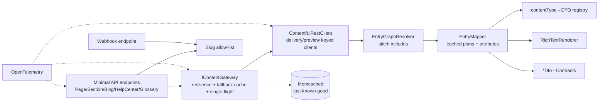

# 00 — Overview, architecture & contract

Read this before any other task. It defines the target architecture, the API contract that must be
preserved, and the cross-cutting concerns (caching, DOS defense, observability, DTO evolution) that
several tasks depend on.

---

## 1. Goals

Rewrite `Legacy.CMS` as a **clean, modern, lightweight** service that:
- Serves the **exact same public API** (routes, response DTOs, `CMSAPIResponse` envelope) — no
  contract breakage. Parity is proven by the harness in Task 08.
- Sources content from the **Contentful REST Content Delivery / Preview API** (not GraphQL).
- Maps content generically (convention-driven, Option 2) — no `Gql*` models, no AutoMapper.
- Treats cache as a **disaster fallback**, not a read-through layer (Contentful is fast + CDN-backed).
- Is **resilient to abuse** (a recent random-slug DoS) via a slug allow-list + Contentful webhook.
- Has **first-class observability** so failures are obvious.
- Lets us **evolve DTOs safely** as content types change, without breaking v1 until tested.

## 2. Tech decisions (locked)

| Area | Decision |
|---|---|
| Runtime | **.NET 10 (LTS)** |
| Endpoints | **Minimal APIs** (route groups + `TypedResults`), API versioning via `Asp.Versioning.Http` |
| Mapping | **Reflection with cached compiled plans** (built once per type), regular JIT (no AOT) |
| Cache | **Fallback-only** (fire-and-forget), store = **Memcached** (existing infra) |
| DoS defense | **Slug allow-list + Contentful webhook** (rate limiting handled at gateway/CDN, not in-app) |
| Resilience | `Microsoft.Extensions.Http.Resilience` (Polly v8: timeout, retry, circuit breaker) |
| Observability | **OpenTelemetry** (traces/metrics/logs) → **Azure Monitor / App Insights** |
| Serialization | `System.Text.Json`, **PascalCase**, **nulls written**, default HTML-escaping encoder (matches legacy `AppConstant.JsonSerializerOptionsResponse = new()`) |

## 3. Solution structure (slim — 3 projects + tests)

```
API.Contentful/
  API.Contentful.sln
  src/
    API.Contentful.Contracts/        # DTOs = the FROZEN wire contract (+ mapping attributes). Task 02
    API.Contentful.Infrastructure/       # REST client, EntryGraphResolver, EntryMapper, rich text,
                               #   resilient content gateway, allow-list, registry. Tasks 01,03-07,10,11
    API.Contentful/              # Minimal API host: endpoints, DI, middleware, webhook, OTel. Tasks 09,12
  test/
    API.Contentful.ParityTests/     # old-vs-new live diff + contract snapshots. Task 08
    API.Contentful.UnitTests/       # mapper/resolver/gateway units
  docs/rest-migration/         # these task files
  Dockerfile  deploy/
```

> Keep DTO **class names, property names, and JSON output** identical to the old service. Their
> namespace changes to `API.Contentful.Contracts.*` (namespace does not affect JSON). All old
> `Application.Dtos` / `Interface` (ISection/ICard/IMedia) types move here.

**Not ported (deleted):** all GraphQL — `.graphql` files/fragments, `GraphQlClient`, `Gql*` models,
`Gql*Converter`, `DynamicQueryBuilder`, `ContentMappingProfile` (AutoMapper), `RichTextLinkService`
(folded into `EntryGraphResolver`). The old MVC controllers and old `ContentService` are **not**
copied verbatim (replaced by Minimal APIs + the resilient content gateway) — the parity harness is
the safety net.

**Ported (behaviour-preserving):** the rich-text → HTML renderer (`ContentfulRichTextHelper`),
`PagingHelper`, cache-key conventions, auth (preview API-key scheme + policy), constants/enums,
the `Defaults/Json` section fallbacks, and health.

## 4. Component architecture



`IContentProvider` (same operations as old) is implemented by the Contentful mapping stack; the
**`IContentGateway`** wraps it with resilience + fallback caching (Task 10). Endpoints depend on the
gateway, not the provider directly.

## 5. The API contract (must not change)

- **Routing.** Reproduce every route the old service exposed, including the `v{version:apiVersion}`
  variants and the odd ones (`/api/HelpCenter`, absolute `/HelpCenter/list`). See the inventory
  below; each domain task defines its route group.
- **Envelope.** `CMSAPIResponse<TData,TError>` = `{ Data, Error }` (PascalCase; `StatusCode` is
  `[JsonIgnore]` — never in the body; `Error` omitted when null).
- **JSON.** ⚠️ **CORRECTION (2026-07-29, verified against the legacy API):** the legacy wire format is
  **PascalCase, nulls WRITTEN, default (HTML-escaping) encoder** (`<` → `\u003C`). The legacy envelope
  serializes via a custom `ActionResult` using a **default** `JsonSerializerOptions`, which BYPASSES the
  MVC `AddJsonOptions(camelCase)` config — so the earlier "camelCase / WhenWritingNull" spec in this
  plan was WRONG and broke parity on every endpoint. Match legacy's default options exactly.
  (Note: the mapper still reads Contentful **source** field ids in camelCase — that is unrelated to the
  output casing and is correct.)
- **Auth.** Legacy gated preview via `CMSPreviewAccessPolicy`. **Decision (2026-07-29): preview does
  NOT require API-key authentication** (UAT serves preview openly); the new service should not require
  it either. Preview-origin restriction (`preview.example.com`, Task 15) may remain as defense-in-depth.
- **Culture.** `en-US` default thread culture (date formatting).
- **Errors.** Same status codes + error messages/constants as old (NotFound/BadRequest bodies).

### Endpoint inventory
> `v1/...` variants exist for the versioned groups. Each domain task owns its group.

| Group | Method & route | Provider op | Returns | Task |
|---|---|---|---|---|
| Page | `GET /Page?slug=&isPreview=` | `GetPageBySlugAsync` | `PageDto` | 03 |
| Page | `GET /Page/slugs` *(anon)* | `GetAllPageSlugsAsync` | `HashSet<string>` | 03 |
| Section | `GET /Section?type=&isPreview=` | `GetSectionByTypeAsync` | `object` | 04 |
| Blog | `GET /Blog?slug=&isPreview=` | `GetBlogBySlugAsync` | `BlogPostDto` | 05 |
| Blog | `GET /Blog/getBlogsByCategory` | `GetBlogsByCategoryAsync` | `BlogsDto` | 05 |
| Blog | `GET /Blog/search` | `GetBlogsBySearchParamAsync` | `BlogsDto` | 05 |
| Blog | `GET /Blog/getBlogsByTag` | `GetBlogsByTagAsync` | `BlogsDto` | 05 |
| Blog | `GET /Blog/getBlogsByAuthor` | `GetBlogsByAuthorAsync` | `BlogsDto` | 05 |
| Blog | `GET /Blog/getRecentBlogs` | `GetRecentBlogPosts` | `List<BlogPostCardDto>` | 05 |
| Blog | `GET /Blog/getBlogs` | `GetBlogIndexAsync` | `BlogIndexDto` | 05 |
| Blog | `GET /Blog/list` | `GetBlogPostListAsync` | `BlogPostListDto` | 05 |
| HelpCenter | `GET /api/HelpCenter?slug=` | `GetArticleBySlugAsync` | `HelpCenterArticleDto` | 06 |
| HelpCenter | `GET /api/HelpCenter/category` | `GetArticlesByCategoryAsync` | `ArticleListDto` | 06 |
| HelpCenter | `GET /api/HelpCenter/tag` | `GetArticlesByTagAsync` | `ArticleSummaryListDto` | 06 |
| HelpCenter | `GET /api/HelpCenter/search` | `GetArticlesBySearchParamAsync` | `ArticleListDto` | 06 |
| HelpCenter | `GET /HelpCenter/list` | `GetHelpCenterArticleListAsync` | `HelpCenterArticleListDto` | 06 |
| Glossary | `GET /Glossary/list` | `GetGlossaryCardListAsync` | `GlossaryCardListDto` | 07 |
| Internal | `POST /internal/contentful/webhook` *(secured)* | allow-list update | 202 | 11 |
| Health | `GET /Health` | — | health | 12 |

## 6. Contentful REST essentials

- Delivery host `https://cdn.contentful.com` + delivery token; preview `https://preview.contentful.com`
  + preview token. Path `/spaces/{space}/environments/{env}/entries`.
- Single entry: `?content_type={id}&fields.slug={slug}&include=10&limit=1`.
- Response = `{ items, includes:{Entry,Asset}, total, skip, limit }`; links are
  `{sys:{type:Link,linkType,id}}` stitched from `includes` by id. `include` max = 10.
- Rich text fields returned as the document JSON directly (old GraphQL wrapped as `{json}`).
- Assets: `fields.file.url`, `fields.file.details.image.{width,height}`, `title`, `description`.
- Query ops: `fields.x[match]`, `fields.x[in]`, `fields.x[ne]`, `order` (`-` prefix = desc),
  `limit`, `skip`, `select`, `metadata.tags.sys.id[in]`, `links_to_entry`.

## 7. Polymorphism: contentType → `kind` → DTO

Old code discriminates on GraphQL `__typename` (`kind`); REST uses `sys.contentType.sys.id`
(≈ camelCase of `kind`). Task 02 builds the authoritative map by cross-referencing the old
`GqlSectionConverter`/`GqlCardConverter` against real content types (Contentful MCP), recording
every irregular case. Verified 2026-07-29 (space `your-space-id`/`Dev`): field ids match old camelCase
1:1; content-type id PascalCased = `kind`.

## 8. Caching model — fallback only (Task 10)

- **Always fetch live** from Contentful on the request path (tight timeout).
- Success → return, then **fire-and-forget** write mapped result as *last-known-good* to Memcached
  (no/long TTL — a disaster snapshot, not an expiry cache). Throttle writes (skip if entry refreshed
  within N seconds) to avoid write amplification.
- Contentful failure/timeout → serve last-known-good; miss → `503` problem+json.
- **Circuit breaker** short-circuits to cache when Contentful is unhealthy; half-open probes recover.
- **Single-flight coalescing** collapses duplicate concurrent requests for the same key.
- **Preview** requests never use cache (always live).
- Memcached is volatile → the cache is best-effort; correctness never depends on it.

## 9. DoS defense — allow-list + webhook (Task 11)

- **Slug allow-list**: in-memory set (per instance) of all valid slugs (pages + blog + help-center
  article), rebuilt from Contentful at startup + refreshed by webhook + periodic reconcile. Requests
  for unknown slugs → **404 immediately**, no Contentful call (kills random-slug amplification).
- **Webhook** `POST /internal/contentful/webhook`: Contentful publish/unpublish → add/remove slug.
  Secured by shared-secret header + HMAC signature; payload validated, never blindly trusted.
- Rate limiting is handled at the **gateway/CDN** (out of scope for this service).

## 9a. CORS &amp; preview-origin restriction (Task 15)

- **CORS** allows only configured browser origins (`CMS:Cors:AllowedOrigins`) — methods `GET,OPTIONS`.
- **Preview** (`isPreview=true`) is restricted to `CMS:Cors:PreviewOrigins` (prod: `https://preview.example.com`).
  Enforced for browser calls via `Origin`/`Referer`; server-side (SSR) calls without an origin header
  remain gated by the **preview API key** (the authoritative boundary — CORS is browser-side only).
- Already scaffolded: `CorsOptions`, `PreviewOriginMiddleware`, policy wiring in `Program.cs`.

## 10. Observability (Task 12)

OpenTelemetry traces + metrics + structured logs → App Insights. Key metrics: Contentful
latency/error-rate, circuit state, cache-fallback-served, **allow-list rejections** (attack signal),
webhook applied/failed, mapping errors (unknown type / unresolved link). Correlation ids on every
log; `/health` includes a Contentful reachability check.

## 11. DTO evolution without breaking the contract (guardrails in Tasks 02 & 08)

- **Decouple** wire contract (DTO property → JSON) from Contentful source via `[ContentfulField]` —
  a Contentful field rename is a one-attribute change; output unchanged.
- **Additive-safe**: new nullable DTO props are non-breaking; the mapper tolerates missing source.
- **Contract snapshot tests** (golden JSON per endpoint) fail CI on unintended shape changes.
- **Breaking changes → v2** via API versioning; v1 stays frozen.
- Test content-model + DTO changes against a **Contentful sandbox environment** first.

## 12. Config keys

```
CMS:Provider = ContentfulRest
CMS:Contentful:SpaceId / Environment / DeliveryToken / PreviewToken
CMS:Contentful:BaseDeliveryUrl = https://cdn.contentful.com
CMS:Contentful:BasePreviewUrl  = https://preview.contentful.com
CMS:Contentful:MaxInclude      = 10
CMS:Contentful:RequestTimeoutSeconds = 3
CMS:Contentful:WebhookSecret         = <secret>     # Task 11
CMS:Cache:FireAndForgetMinIntervalSeconds = 60      # write throttle (Task 10)
CMS:AllowList:ReconcileIntervalMinutes    = 15      # Task 11
CMS:Cors:AllowedOrigins = [ https://www.example.com, https://example.com, https://preview.example.com ]  # Task 15
CMS:Cors:PreviewOrigins = [ https://preview.example.com ]                                          # Task 15
CMS:Memcached:*  (unchanged)   ApplicationInsights:* / OTel exporter (Task 12)
MappingOptions:MaxDepth = 64   # mapper recursion cap
```

## 13. Out of scope
- Any response shape/field/route/status/error change. New features/fields. Changing auth or the
  gateway/CDN rate-limiting layer. Native AOT.
