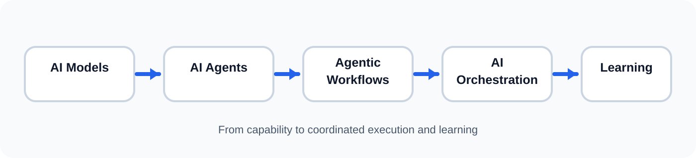
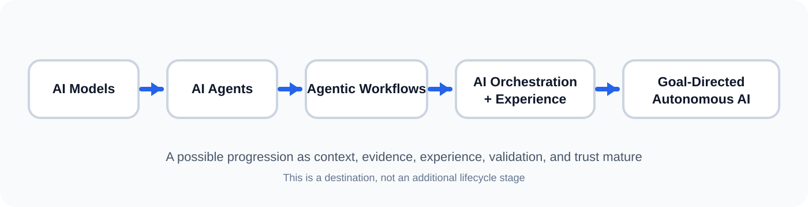

# AI Orchestration Model

## Purpose

The AI Orchestration Model is a simple, repeatable lifecycle for integrating AI into business and engineering workflows.

Rather than focusing on prompts, tools, agents, or individual models, it focuses on how humans and AI turn an opportunity into a measurable outcome and improve the system through learning.

## From AI Models to AI Orchestration

AI capabilities are evolving from models that provide intelligence to agents that can act, workflows that can repeat and coordinate tasks, and orchestration systems that can learn from outcomes.

This is not a strict replacement hierarchy. Agentic workflows can be an important building block within an orchestration system. The distinction is the scope of learning and context.

> **Agentic workflows repeat. Orchestration learns.**

A workflow is primarily designed to execute a known process repeatedly. An orchestration system captures what was learned from those outcomes and makes relevant context available to the next opportunity.

The context can accumulate at the appropriate scope — an individual, a team, an organization, or another defined boundary.

## Core Lifecycle

> **Opportunity → Understand → Plan → Execute → Proof → Grow**

The lifecycle is intentionally simple. Each stage has a distinct responsibility; the complexity belongs in the context, ownership, evidence, and feedback surrounding each stage—not in adding more stages.

- **Opportunity** — define the problem, why it matters, and the outcome worth pursuing.
- **Understand** — establish the context and evidence required to make a sound decision.
- **Plan** — determine the focused path, boundaries, dependencies, and ownership required to reach the outcome.
- **Execute** — perform the planned work while adapting when new evidence requires a change in direction.
- **Proof** — demonstrate with evidence that the intended outcome actually happened.
- **Grow** — turn the outcome into better future capability by capturing validated experience, developing reusable expertise, and improving the context, workflow, or decisions for the next cycle.

The lifecycle continuously loops as learning creates better context and new opportunities.

---

## Stage 1 — Opportunity

Define the problem, why it matters, and the outcome worth pursuing.

The opportunity should describe why the work matters and what meaningful outcome is expected. A ticket or task can be an input, but it is not the outcome itself.

### Questions

- What problem are we solving?
- Why does it matter?
- What outcome would make this worthwhile?
- How will we recognize success?

### Deliverables

- Opportunity statement
- Expected outcome
- Initial success criteria
- Relevant stakeholders

## Stage 2 — Understand

Establish the context and evidence required to make a sound decision.

AI should first gather the context required to reason about the opportunity. This can include repositories, architecture, telemetry, business rules, dependencies, historical incidents, previous attempts, documentation, and organizational knowledge.

If context is missing, the orchestrator should identify the gap and retrieve or request it before execution. The goal is not to collect everything; it is to collect what is necessary to make a sound plan.

### Questions

- What happened or what is the current state?
- What context is required?
- What do we already know?
- What is still missing?
- Who owns the relevant outcome or flow?
- What constraints must be respected?

### Deliverables

- Working context
- Relevant evidence
- Known assumptions and gaps
- Ownership and boundaries

## Stage 3 — Plan

Determine the focused path, boundaries, dependencies, and ownership required to reach the outcome.

Planning determines what should happen, what should not happen, what can be done independently, and who or what owns each part.

Parallelism is used only when work is genuinely independent. More agents or people do not automatically mean faster delivery; coordination cost is part of the plan.

### Questions

- What is the smallest coherent path to the outcome?
- What dependencies exist?
- What should be done sequentially?
- What can safely run in parallel?
- Who owns each part?
- What decisions require human approval?

### Deliverables

- Focused execution plan
- Ownership boundaries
- Dependencies
- Validation strategy
- Approval points

## Stage 4 — Execute

Perform the planned work while adapting when new evidence requires a change in direction.

Humans and AI can collaborate across analysis, implementation, testing, investigation, documentation, and operational tasks. Delegation does not remove accountability for the outcome.

Execution should remain observable, attributable, and reversible where practical. New evidence can require replanning rather than blindly continuing the original plan.

### Questions

- Is the work staying within the planned scope?
- Is ownership clear?
- Are assumptions changing?
- Does new information require replanning?

### Deliverables

- Implemented change or action
- Execution trace
- Updated assumptions when required

## Stage 5 — Proof

Demonstrate with evidence that the intended outcome actually happened.

Proof is stronger than output validation. A generated artifact, successful build, passing test, or merged PR may be necessary, but the orchestration is not complete until evidence connects the work back to the original outcome.

Proof can include tests, before/after measurements, telemetry, non-production validation, production signals, user feedback, or other objective evidence.

For production remediation, the loop can continue through deployment and observation until the original production signal is demonstrably resolved.

### Say what your evidence actually is

Not every task has telemetry, and pretending otherwise makes Proof unusable for most work. What matters is describing what you actually did to check, in words a reader can act on.

Four questions do the work:

- **Did anyone verify it, or is someone asserting it?** "It works" from a person or a model establishes nothing on its own.
- **Does it hold up again?** Something seen working once may not repeat. An automated check that fails without the change and passes with it is a different claim from a manual look.
- **Did the thing you cared about move?** A passing test says the code behaves; a before-and-after measurement says the problem changed.
- **Did it hold where it counts?** The strongest evidence is the original signal disappearing in the real environment and staying gone.

> **State what you checked, what you observed, and where you stopped.**

Stopping early is fine and often correct — a small internal change may be genuinely complete once a test covers it, and production observation is not always available or worth the cost. What is not fine is describing weak evidence in language that sounds like strong evidence. "Verified in the test environment; not yet observed in production" is a complete, honest claim. "Verified" alone is not.

### When Proof fails

Failed proof is a normal outcome, not an exception to handle later. When the evidence does not support the intended outcome, **return to Understand, not to Execute.** A failed proof usually means the understanding was incomplete, so another attempt at the fix repeats the original mistake faster.

### Questions

- Did the original problem actually improve or disappear?
- What evidence proves it?
- Was the change safe and within expectations?
- What remains uncertain?

### Deliverables

- Evidence of outcome
- Validation results
- Risk and approval evidence where required
- Outcome status

## Stage 6 — Grow

Turn the outcome into better future capability by capturing validated experience, developing reusable expertise, and improving the context, workflow, or decisions for the next cycle.

Growth is more than a retrospective. It is where the system captures meaningful experience from execution, validates what was learned, identifies patterns across repeated outcomes, and updates the context, knowledge, workflows, or expertise that can improve future decisions.

> **Execute produces experience. Grow turns validated experience into expertise.**

### Experience and Expertise

**Experience** is what was learned from a specific execution — what was tried, the relevant context, the evidence observed, and the outcome.

**Expertise** is the reusable knowledge or decision pattern that emerges from multiple validated experiences. A single execution should not automatically become expertise.

The resulting expertise can become part of the context available during the next **Understand** and **Plan** stages, allowing future decisions to start from a stronger position rather than treating every similar task as a new problem.

This is how the orchestration system can compound capability over time without adding Experience or Expertise as separate lifecycle stages.

### Questions

- What did we learn?
- What context was missing?
- What actions and outcomes are worth retaining as experience?
- Which experiences are sufficiently validated to influence future decisions?
- What patterns are emerging across similar executions?
- What should the next human or AI know?
- What should change in the workflow?
- What new opportunity did we discover?

### Deliverables

- Updated organizational context
- Validated experience
- Reusable expertise or patterns where justified
- Retrospective / lessons learned
- Improved workflow or guardrails
- New opportunities

---

## Toward Goal-Directed Autonomous AI

The six-stage lifecycle is the operating model. **Autonomy is the destination that can emerge as the model, tooling, experience, validation, and trust mechanisms become sufficiently mature.**

The framework does not treat autonomy as another lifecycle stage. Each stage contributes a capability required for increasingly autonomous goal-directed execution.

Today, a human may provide both the goal and much of the path. As the orchestration system matures, the human can increasingly provide the **objective, constraints, and success criteria**, while AI determines and adapts the path using current context and accumulated experience.

> **Human defines the destination. AI determines and continuously adapts the path.**

This does not mean removing humans from the system. Human responsibility moves toward defining objectives, constraints, risk boundaries, authority, and success criteria, while AI takes on more of the planning, execution, observation, and adaptation within those boundaries.

### Widening what AI decides

"Increase autonomy as trust matures" is only useful if you can say what decides it. Three rules do:

- **Results decide, not confidence.** Widen what AI determines for itself where outcomes of that kind have repeatedly held up without rework or intervention. Narrow it again the moment they stop.
- **Blast radius overrides track record.** Where a mistake is expensive or hard to reverse, human approval stays regardless of how well things have gone.
- **It is granted per context, not globally.** A team may let AI plan and execute freely inside a well-understood remediation flow while approving every step of anything touching customer data.

What moves is how much of the *path* AI determines — from drafting steps a human approves, through executing an agreed plan, to planning within stated constraints. What does not move is who owns the objective, the constraints, and the outcome.

The framework's purpose is not to claim that unrestricted autonomy exists today. It is to provide an architecture that can progressively support greater autonomy as reasoning, tools, persistent context, experience, validation, and trust mature.

## Applying the Model

The model is technology independent and can be applied to:

- Software Engineering
- DevOps
- Quality Assurance
- Production Operations
- Customer Support
- Security Operations
- Product Management
- Finance
- Human Resources
- Business Operations

For practical patterns, see **[Reference Implementations](reference-implementations.md)**.

### Example: Production Exception Remediation

A production exception can be orchestrated as:

**Opportunity** — resolve a recurring production exception.

**Understand** — read the ticket, inspect logs, code, telemetry, dependencies, history, and existing knowledge before changing anything.

**Plan** — identify root cause, define a focused fix, establish ownership, validation steps, and human approval boundaries.

**Execute** — implement the fix and create the change/PR.

**Proof** — validate in non-production, provide concrete evidence for human approval, deploy, and verify the original production exception resolves.

**Grow** — close only when the production outcome is proven; capture the learning as validated experience so future incidents can be understood faster and repeated patterns can contribute to expertise.

### Example: Cross-Team Knowledge Gap

A team should not need to contact several teams simply to reconstruct information that already exists in repositories, jobs, telemetry, documentation, or historical context. An AI knowledge capability can retrieve and explain that context, while humans remain responsible for decisions and ownership.

## Key Takeaway

AI orchestration is not about maximizing AI activity or parallelism.

It is about turning distributed capability into coherent outcomes through:

**Understanding → focused planning → owned execution → proof → continuous growth.**

> **Opportunity → Understand → Plan → Execute → Proof → Grow**
