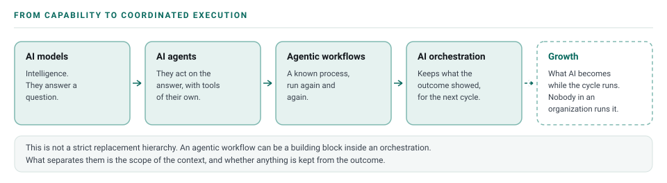
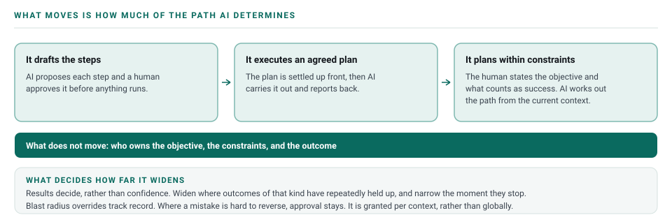

# The Clover Framework

## Purpose

Clover is an AI Orchestration Framework connecting real-world Context, human Direction, AI-driven Action, and validated Success into a repeatable cycle.

Prompts, tools, agents, and AI model choice all sit underneath the cycle. What the framework describes is how human intent becomes an outcome the environment confirms, and what the next attempt starts from.

**The framework is four stages: Context → Direction → Action → Success.**

## Three leaves, then four, then five

The number of leaves carries the argument. The stages arrived in a different order than they run in, and the way they arrived is the clearest way to explain them.

### Three leaves — the common clover

Direction, Action, Success. This is how AI is used almost everywhere today. A human gives the Direction. AI performs the Action from whatever that one human can hand over: not only what they type, but the files they attach and the repository they happen to be working in. After several passes the result becomes Success.

It works, and a lot of real value comes out of it. It is also ordinary, which is what a common clover is. The limit is that a handover is still bounded by what one human can reach and remember, put together from memory and usually in a hurry. Whatever context the work runs on arrives after the direction, because the direction is what prompted somebody to go and find it.

### Four leaves — the lucky clover

Context arrives, and it arrives first. It is no longer bounded by one human: it is the current systems the organization uses. Every repository, with its many projects and the documentation kept for each application. The datasources the applications connect to. The logs and telemetry. The deployment environments. The running applications themselves. Nobody has to write any of it out first.

That is why Context leads. Those systems are already running before anyone asks for anything, so the material is there ahead of the request rather than assembled in response to it. Direction is then given against what is actually there, which is also what lets Direction point at where the answer probably is.

Reaching it takes a setup rather than a principle:

1. **Stand up read-only MCP servers** in front of the repositories, the datasources, the logs and telemetry, and the environments, so an agent can read them directly.
2. **Scope every connection to what the human driving the work already has access to**, at the privileges they already hold. Nothing new is being granted.
3. **Start with one environment. Development is enough.** Widen to other non-production environments as it proves out.

[The orchestration environment](orchestration-environment.md#building-one) covers what to connect and in what order, and [governance](08-governance.md#access-mirrors-the-human-not-the-ai) covers how that access is held.

The approach gets challenged, and the honest answer holds up. That access already exists and is already used, often with nobody tracking it. Clover makes it deliberate, scoped and visible. It also surfaces stale credentials, unreviewed access paths and data nobody has looked at, before any of those become an incident. [The questions a security team will ask](08-governance.md#questions-your-security-team-will-ask) are answered one by one.

Connecting the material does not finish the job. An organization's systems are a haystack and the thing worth finding is a needle somewhere inside it, and expecting AI to search the whole haystack does not work. **That is what changes Direction.** The people who work on a system every day know roughly where the needle fell, so Direction becomes a pointer at the part of the system to read first. Direction that points, together with context that is real, is what produces Success worth having.

It runs in a loop. What comes back from one pass is context for the next. Markdown files kept beside the work hold the summary, and that summary is what lets any agent pick the job up, so no single agent has to hold the work. [Context](05-context-engineering.md#where-context-lives) covers how those files are kept.

> After each success and each failure, the context files are written before the next attempt.

A lucky clover is the rare one, and this is the stage that makes it rare. It is also where organizations are now.

### Five leaves — the growth clover

Growth is the next stage. It happens whether or not anyone chooses it.

AI becomes more capable from what it takes out of the other four stages: the context it read, the direction it was given, the actions it ran, and the results it saw confirmed. Patterns form across an enormous number of cycles, and expertise forms out of the patterns.

Nobody in an organization operates this one. It belongs to the frontier AI companies, who hold the volume of data that everyone's usage generates. There is no step to run and nothing to adopt. Treating it as a step somebody owns produces a folder of "learnings" nobody reads. What a team keeps from its own cycles — what was tried, the context it ran in, the evidence observed — goes into Context, beside the work, where the next cycle reads it.

That is a general statement about how information accumulates. It says nothing about any AI provider training on customer or enterprise work, and many state plainly that they do not.

Everything below sets out the four stages one at a time, in the order they run.

## From AI models to AI orchestration

AI capability is evolving from models that provide intelligence, to agents that can act, to workflows that repeat and coordinate tasks, to orchestration that keeps what its outcomes taught it.

This is not a strict replacement hierarchy. An agentic workflow can be an important building block inside an orchestration. What separates them is the scope of context and learning. A workflow runs a known process repeatedly. An orchestration captures what the outcome showed and makes that available to the next cycle.

Context can accumulate at whatever scope fits — a human, a team, an organization, or another defined boundary.

## The four stages

Each stage has one job. The complexity belongs in the context, ownership, evidence, and feedback around the stages, and not in adding more of them.

| Stage | What it is | Core question |
|---|---|---|
| **Context** | The current systems the organization uses — repositories with their many projects and documentation, the datasources the applications connect to, the logs and telemetry, the deployment environments, the running applications. | What do we need to know about reality before acting? |
| **Direction** | The human controls what matters, the desired outcome, constraints, boundaries, and what must not happen, and approves. With real context available, Direction also points at where the answer probably is. | What needs to be done, and what must not happen? |
| **Action** | AI determines how the work should happen and executes within those boundaries. | What should we do, and how should the work happen? |
| **Success** | The intended outcome demonstrated by the real environment. | Did reality validate the intended outcome? |

A team runs all four, and then runs them again. What one cycle establishes goes into the next cycle's Context, changes how Action gets planned, and sometimes changes the Direction itself, because the work revealed that a different outcome was the one worth pursuing.

---

## Stage 1 — Context

Context is what the system needs to know about reality before acting, and it is in place before anyone gives a direction. In the common clover it is only what one human can hand over — what they type, the files they attach, the repository they are working in — and it stays bounded by what that human can reach and remember. In the lucky clover it becomes the current systems the organization uses. Every repository, with its many projects and the documentation kept for each application. The datasources the applications connect to. The logs and telemetry. The deployment environments. The running applications. Tests, history, earlier attempts, and what previous cycles wrote down sit here too.

Read-only MCP servers in front of those systems are how an agent reaches them. Every connection is scoped to what the human driving the work already has access to, at the privileges they already hold, and one environment is enough to start — development. [Governance](08-governance.md#access-mirrors-the-human-not-the-ai) covers how that access is held.

Prompting is a small part of this. The working rule is to reason from the real environment rather than from assumptions, wherever the environment can answer the question.

One pass rarely finishes it. Every pass adds context, and a markdown file beside the work carries the summary from one pass to the next.

> After each success and each failure, the context files are written before the next attempt.

**Core question.** What do we need to know about reality before acting?

**What the human holds.** Access and judgment. Which systems may be read, which data may be used, which sources can be trusted, where the answer probably is, and when the context in hand is good enough to act on.

**What AI does.** Most of the gathering. Reading code, tracing a call path, pulling telemetry, reconstructing an incident from logs, finding the earlier attempt nobody remembered. It also writes back what the pass established, so the next one starts from it. A good orchestration reports what it could not find, and that part matters most.

**What happens there.** The plausible answer. An AI model working from thin context produces something that reads correctly and describes a system that does not exist. The opposite failure is hoarding, where a context packed with irrelevant material buries the few facts the problem turns on. [How AI fails](how-ai-fails.md) covers the specific patterns, and [context engineering](05-context-engineering.md) covers how the material is assembled.

## Stage 2 — Direction

Direction is where human intent enters the system. The human controls what matters, the desired outcome, constraints, boundaries, and what must not happen. AI determines how the work should happen and executes within those boundaries. The human approves, and approval stays required wherever a mistake is expensive or hard to reverse.

A ticket can trigger it. Direction is the outcome behind the ticket, stated plainly, together with what the work must not touch.

Because the real environment is already readable, Direction also points. The people who work in a system every day know roughly where the answer probably is — which service went out last week, which job has always been fragile, which team owns the part nobody wrote down. Saying which part of the system to read first is usually worth more than a longer description of the task.

**Core question.** What needs to be done, and what must not happen?

**What the human holds.** All of it — the objective, the priorities, the constraints, the risk boundaries, where the answer probably is, what counts as a good outcome, and what stays out of scope. Ownership of the outcome remains with a human after the work is handed over.

**What AI does.** Sharpens it. AI can restate the objective in its own words, ask what should happen to the parts nobody mentioned, point out that two stated goals conflict, and turn a vague request into something specific enough to work from. Setting the direction stays with the human.

**What happens there.** Direction gets skipped because a ticket looks like enough, and the work then optimizes for closing the ticket rather than for the outcome. Unstated scope is the next one: nobody said the change must not touch billing, so nothing stopped it. The third is a direction with no pointer, which leaves an agent reading everything it can reach, slowly and at cost.

## Stage 3 — Action

AI determines how the work should happen and executes within those boundaries. Reasoning, planning, tool selection, AI model selection, orchestration across agents, code changes, tests, debugging, and interaction with whatever environments the work touches.

Planning and doing sit on one stage on purpose. The plan usually changes once the work meets reality, and keeping the two together makes that change ordinary rather than an exception to explain.

**Core question.** What should we do, and how should the work happen?

**What the human holds.** The boundaries and the approvals. Which decisions need a human before they happen, what may run unattended, and who owns each part when the work is split. Delegation moves the work and leaves accountability where it was.

**What AI does.** Most of the work, inside those boundaries. Choosing an approach, sequencing the steps, picking tools, running subagents where parts are genuinely independent, implementing, testing, and coming back when the evidence contradicts the plan.

**What happens there.** Thrash. A change fails, the next attempt is a variation of the same change, and each attempt sounds as confident as the last. Misplaced parallelism is the other one: splitting work that shares state costs more in coordination and rework than it saves.

## Stage 4 — Success

Success means the real environment demonstrates the intended outcome. The environment is the evidence of success. An AI reporting that it worked, a plausible explanation, a confident tone, and a high model score all fall outside that.

Evidence can be a test that fails without the change and passes with it, a before-and-after measurement, telemetry, a non-production run, a production signal that disappears and stays gone, or a user confirming the outcome.

**Core question.** Did reality validate the intended outcome?

**What the human holds.** The standard. What counts as sufficient evidence for this work, and what risk is acceptable if the answer turns out to be wrong. Approval for anything expensive or hard to reverse stays with a human.

**What AI does.** Runs the checks, gathers the evidence, and reports it accurately, including what did not work and what it could not check.

**What happens there.** Evidence described more strongly than it is. "Verified" covering a single manual look. A merged change reported as a resolved problem. The quiet one is stopping at the artifact: the build passed, so the work is treated as done, and nobody checks whether the original signal changed.

### Say what the evidence actually is

Not every task has telemetry, and pretending otherwise makes this stage unusable for most work. What matters is describing what was actually done to check, in words a reader can act on.

Four questions do the work:

- **Did anyone verify it, or is someone asserting it?** "It works" from a human or an AI establishes nothing on its own.
- **Does it hold up again?** Something seen working once may not repeat. An automated check that fails without the change and passes with it is a different claim from a manual look.
- **Did the thing we cared about move?** A passing test says the code behaves. A before-and-after measurement says the problem changed.
- **Did it hold where it counts?** The strongest evidence is the original signal disappearing in the real environment and staying gone.

State what you checked, what you observed, and where you stopped. Stopping early is fine and often correct — a small internal change can be genuinely complete once a test covers it, and production observation is not always available or worth its cost. What causes damage is describing weak evidence in the language of strong evidence. "Validated in the test environment, not yet observed in production" is a complete and honest claim. "Verified" on its own is not.

### When Success fails

A failed check is a normal outcome rather than an exception to handle later. When the evidence does not support the intended outcome, **return to Context, not to Action.**

Retrying a fix that just failed is the common waste. The second attempt runs on the same information as the first and reaches the same place, faster. A second attempt needs new information: what the environment did instead, which assumption broke, which signal nobody had looked at yet. That new information gets written into the context files before the attempt is made.

More on this stage in [Success in practice](07-success.md).

---

## Widening what AI decides

The four stages are how the work runs. How much of the work AI determines for itself changes over time, as tooling, context, experience, validation, and trust mature.

Today a human often supplies both the outcome and much of the path. As an orchestration matures, the human can supply the objective, the constraints, and what counts as success, while AI determines and adapts the path from current context and accumulated experience.

"Increase autonomy as trust matures" is only useful if a team can say what decides it. Three rules do:

- **Results decide, rather than confidence.** Widen what AI determines for itself where outcomes of that kind have repeatedly held up without rework or intervention. Narrow it again the moment they stop.
- **Blast radius overrides track record.** Where a mistake is expensive or hard to reverse, human approval stays regardless of how well things have gone.
- **It is granted per context, rather than globally.** A team may let AI plan and execute freely inside a well-understood remediation flow while approving every step of anything touching customer data.

What moves is how much of the path AI determines, from drafting steps a human approves, through executing an agreed plan, to planning within stated constraints. Who owns the objective, the constraints, and the outcome does not move. [Governance](08-governance.md) covers how that is held in practice.

## Applying the framework

Clover is technology independent. It fits anywhere work has an intended outcome that somebody has to stand behind:

- Software engineering
- DevOps
- Quality assurance
- Production operations
- Customer support
- Security operations
- Product management
- Finance
- Human resources
- Business operations

For practical patterns, see **[Reference Implementations](reference-implementations.md)**.

### Example: a recurring production exception

**Context** — the repositories, the logs and telemetry, the deployment environments and the running application are already readable, along with the ticket, the history, and any earlier attempt at this exception.

**Direction** — resolve a recurring production exception. Say which systems the fix may touch, what must not happen, who approves the deployment, and which part of the system to look at first.

**Action** — trace the exception through the logs and the code, identify the root cause, make the focused change, write the regression test, raise it for review, and adapt if the evidence contradicts the diagnosis.

**Success** — validate outside production, give the approver concrete evidence, deploy, and watch until the original exception stops appearing and stays gone.

**Then back to Context** — write what this pass established into the file beside the code, whether the exception stopped or not, so the next attempt or the next incident of that shape starts from it.

### Example: a cross-team knowledge gap

A team should not have to contact several other teams to reconstruct information that already exists in repositories, jobs, telemetry, documentation, and history. An AI knowledge capability can retrieve that context and explain it, while people keep the decisions and the ownership.

---

## Note — the hypothesis layer is not in this document

Clover has two layers, and this document is the engineering one. Everything above is meant to be usable today.

The second layer is a question about where the next stage leads: what happens when experience persists, when it is shared across many systems, when it is embodied, and when a system begins to influence the Direction it was given rather than only executing it. That is a question rather than a prediction, and none of it is claimed as established.

It is kept out of this document deliberately. It lives in [the hypothesis](../hypothesis/ai-future.md).
