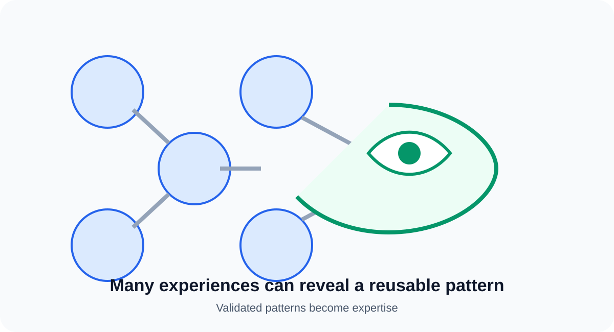
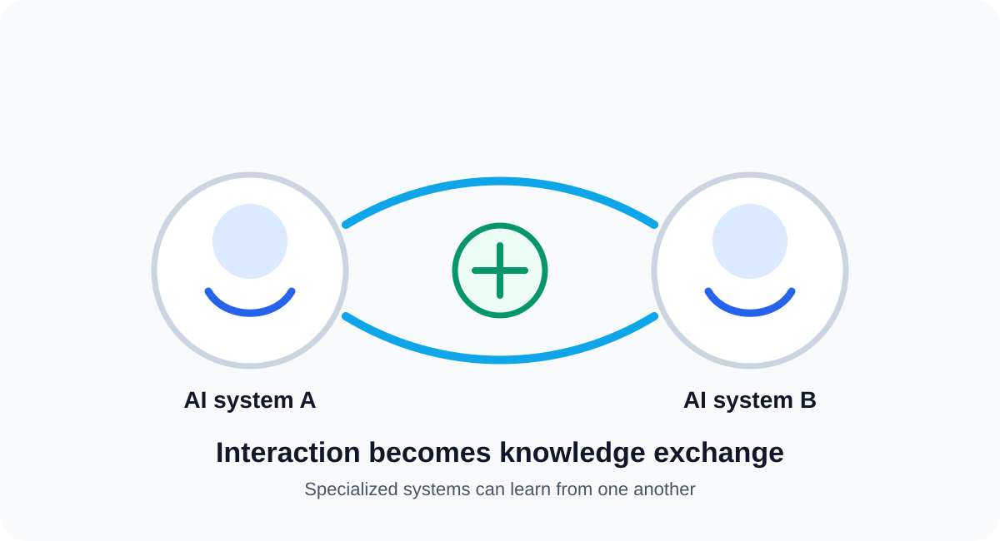
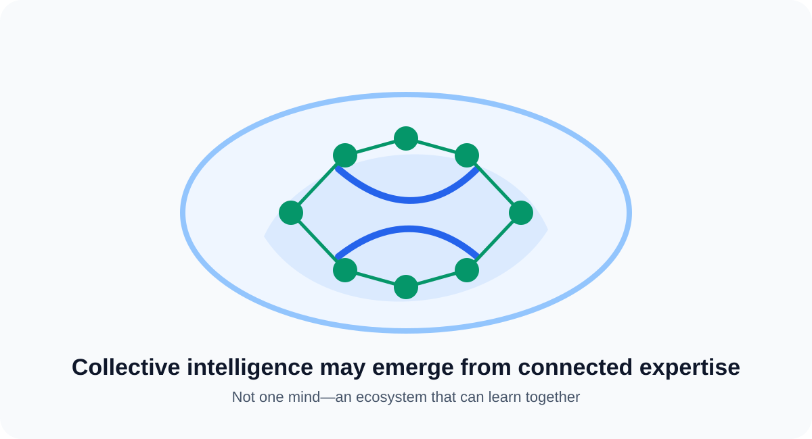
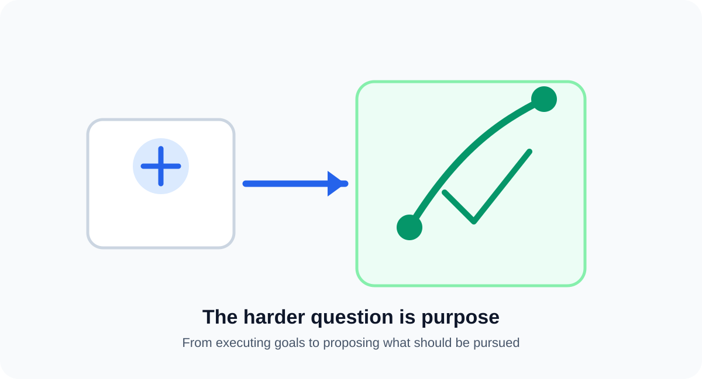
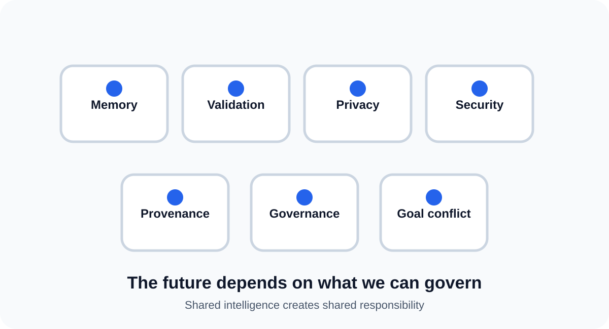
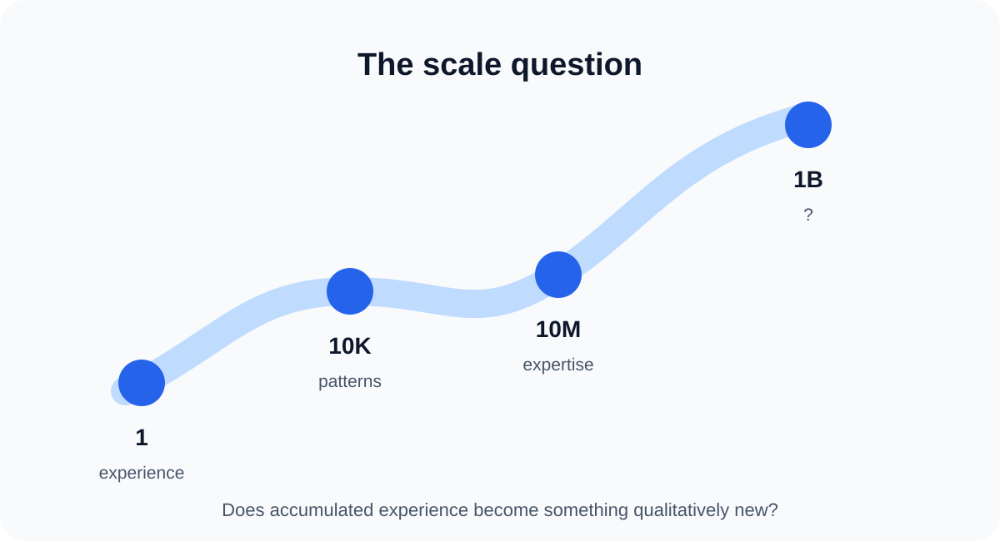

# The AI Future

> **Technical hypothesis — independent from the AI Orchestration Framework**

## What if every AI interaction became an experience?

Today, an AI interaction usually produces an answer or completes a task and ends.

This hypothesis asks what could happen if meaningful interactions also became **validated experience**, reusable **expertise**, and eventually shared knowledge across many AI systems.

> **Today, an AI interaction produces an answer. What if, in the future, every meaningful interaction produced an experience?**

This is a hypothesis, not a prediction or claim about what AI will inevitably become.

## 1. From answers to experiences

A future AI system could retain more than the final answer. It could retain what was attempted, what evidence was observed, what worked, what failed, and what the outcome was.

The important shift is from **conversation history** to **validated experience**.

A stored experience should not automatically become trusted knowledge. It needs context, evidence, provenance, and a way to be corrected later.

## 2. From experience to expertise

Experience is specific to an event. Expertise is a reusable pattern that emerges from multiple validated experiences.

For example, one successful action is an observation. Repeated success across similar conditions, combined with evidence and known failure modes, can become a reusable decision pattern.

> **Experience records what happened. Expertise captures what can be reused.**

This distinction prevents a system from simply accumulating everything it has ever seen and treating it as truth.

## 3. Persistence without continuous execution

Persistent intelligence does not necessarily require one AI process to run continuously.

A system could persist goals, state, progress, open questions, experiences, expertise, and evidence. Each new activation could resume from that accumulated state.

The result would be continuity across interactions rather than a system that effectively starts from zero each time.

## 4. AI systems begin to interact

The hypothesis becomes more interesting when AI systems can exchange validated knowledge and experience.

Different systems could specialize in different domains while sharing relevant expertise. One system's successful discovery could become another system's starting point.

This does not require one giant AI. It could emerge from an ecosystem of specialized systems with governed mechanisms for sharing.

Recent 2026 work is already exploring persistent and shared memory for multi-agent systems, including multi-user memory fabrics and governed shared memory. These developments make the direction technically plausible, while the larger hypothesis remains open.

- [A memory fabric for conversational AI agents enabling shared and persistent multiuser memory](https://doi.org/10.1007/s44163-026-00992-z)
- [From the Internet of AI Agents to the Society of Agents](https://link.springer.com/article/10.1007/s44227-026-00107-1)

## 5. From shared experience to collective expertise

At sufficient scale, experiences from many interactions could become a shared resource.

The important question is not simply how much information is stored. It is whether the ecosystem can determine:

- which experiences are reliable,
- which patterns generalize,
- which knowledge has become outdated,
- where agents disagree,
- who has evidence for a claim, and
- when knowledge should be revised or forgotten.

Shared memory therefore becomes both an **intelligence substrate** and a **governance problem**. Recent work explicitly identifies provenance, validation, access control, conflict resolution, forgetting, and memory poisoning as important design problems.

- [Governed Collaborative Memory as Artificial Selection in LLM-Based Multi-Agent Systems](https://arxiv.org/abs/2605.04264)
- [From the Internet of AI Agents to the Society of Agents](https://link.springer.com/article/10.1007/s44227-026-00107-1)

## 6. Collective intelligence

If AI systems can continuously contribute validated experience and reuse one another's expertise, the resulting intelligence could become larger than the capability of any isolated system.

This would be different from simply connecting agents through messages. The systems would have a persistent body of shared learning that changes future decisions.

Research on multi-agent memory and self-evolving systems is beginning to test parts of this idea. Early results suggest persistent memory can improve long-horizon coordination and task performance, but they do not establish the much larger claim of collective intelligence.

- [Self-Evolving Multi-Agent Systems via Decentralized Memory](https://arxiv.org/abs/2605.22721)
- [MeMAT: Multi-agent transformer with deep long-term memory, short-term memory, and persistent memory](https://doi.org/10.1016/j.neucom.2026.134438)

## 7. The harder question: purpose

There is a fundamental difference between **autonomy of execution** and **autonomy of purpose**.

Today, humans generally define the objective and AI determines how to accomplish it.

A more advanced system might identify opportunities and propose objectives for human approval. A still more advanced ecosystem could potentially coordinate competing objectives across many systems.

Whether AI should ever have meaningful autonomy over purpose is a separate question involving values, authority, governance, incentives, safety, and human control.

This hypothesis does **not** assume that AI should independently choose humanity's purpose.

## 8. What could prevent this future?

The future described here is not guaranteed. Major technical and societal challenges include:

1. **Memory quality** — separating useful experience from noise.
2. **Validation** — determining when an experience is trustworthy.
3. **Provenance** — knowing where a shared belief came from.
4. **Conflict resolution** — handling contradictory knowledge.
5. **Forgetting** — retiring stale or invalid expertise.
6. **Privacy** — controlling what can become shared knowledge.
7. **Security** — preventing poisoning of shared memory.
8. **Incentives** — understanding why independent systems would share learning.
9. **Governance** — controlling authority over shared knowledge and actions.
10. **Goal conflict** — handling incompatible objectives.

These are not secondary implementation details. They may determine whether collective AI becomes useful, fragmented, unsafe, or impossible.

## 9. The scale question

Consider the progression:

**1 interaction** → an experience

**10,000 interactions** → patterns begin to emerge

**10,000,000 interactions** → large-scale expertise becomes possible

**1,000,000,000 interactions** → **?**

The question mark is the heart of the hypothesis.

Does persistent experience across many AI systems create a form of intelligence that is qualitatively different from today's isolated AI systems?

We do not know.

## A possible future

The hypothesis is not that every AI becomes one mind. A more plausible form could be an ecosystem of independent systems that share selected, governed knowledge and experience.

The progression might look conceptually like:

**AI models → AI agents → persistent AI → AI-to-AI interaction → shared experience → collective expertise → collective intelligence → collective goal pursuit**

This is deliberately presented as a **future-state hypothesis**, not a lifecycle stage of the AI Orchestration Framework.

## How we could test the hypothesis

The idea can be investigated incrementally:

- Measure whether persistent experience improves repeated task performance.
- Compare isolated agents with agents that share validated experience.
- Study how expertise should be formed, scored, updated, and retired.
- Measure whether agent-to-agent knowledge exchange improves collective outcomes.
- Test whether shared memory improves long-horizon coordination.
- Establish provenance, privacy, and governance mechanisms before increasing autonomy.

The question is therefore not simply **whether AI will become autonomous**.

> **Can intelligence compound when experience becomes persistent, expertise becomes reusable, and AI systems can learn from one another?**

That is the hypothesis.

---

**Status:** Technical hypothesis — August 2026  
**Relationship to the framework:** Independent future-state exploration. The AI Orchestration Framework addresses engineering AI orchestration today; this essay explores a possible longer-term future for persistent, interacting, and collectively learning AI systems.
