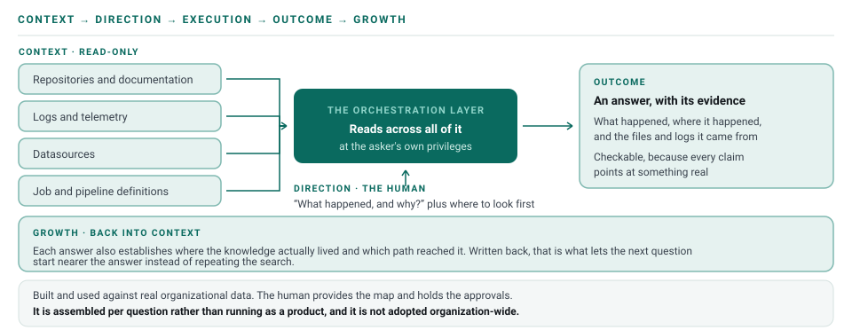
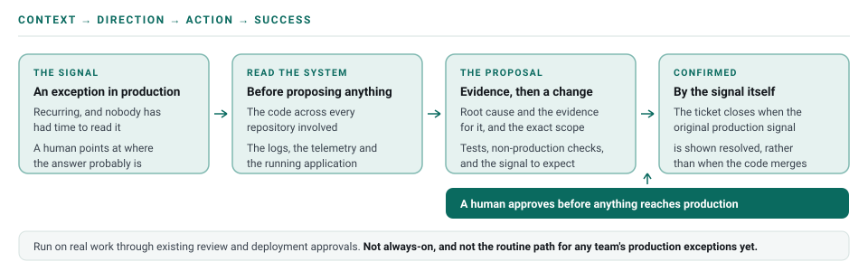

# Reference Implementations

Four patterns teams can adopt and adapt. They are not separate frameworks. Each one shows how [the Clover framework](04-framework.md) applies to a recurring organizational problem.

> **Status — what these actually are.** The first three have been **built and used against real organizational data** — repositories, logs, telemetry and job definitions.
>
> The runtime enforcement reference is an **executable reference pattern**, not a claim that Clover itself provides a production enforcement service.
>
> None of these patterns is always-on, and none is adopted organization-wide. The knowledge capability is assembled per question rather than running as a product. Each pattern depends on a human providing the Direction, reviewing the output, and holding the approvals.
>
> These patterns assume an [orchestration environment](orchestration-environment.md) is in place — access across the systems the organization already runs, scoped to the work.

## 1. Cross-Team Knowledge Access

**Type:** Reference Capability

### Underlying problem

Knowledge is distributed across repositories, tickets, telemetry, jobs, documentation, and teams. People often spend time finding **who knows the answer** instead of finding the answer itself.

This becomes especially costly when ownership changes, teams are reorganized, or historical knowledge is no longer held by a current team.

### Implementation

Give an AI knowledge capability read-only access to relevant organizational sources so people can ask questions such as **"What happened, and why?"**

### Direct examples

**Customer Support Request**

A support executive asks why a customer request failed. AI reads the relevant source, logs, and recent context and explains the failure without requiring the executive to contact multiple teams first.

**Data Team Knowledge Gap**

A data team asks why a synchronization job did not run. AI reads the relevant repository and scheduled job definitions, reconstructs the flow, and explains the failure even when the team that originally owned the flow is no longer available.

**Out-of-Context Owner**

Someone accountable for an area they have not worked on — a lead who has been away from the code, a new joiner, anyone returning to a system that moved on without them — asks where a reported behavior originates. The capability reads across the repositories involved and reproduces the behavior in the running application, locating the cause without the human first having to learn the area.

The knowledge was never missing. It was in the code and in the running system, and simply had not been reachable without someone who already held it.

### Outcome

> Reduce unnecessary coordination by making existing organizational knowledge directly accessible.

The examples above were run against real systems, and in both the answer was reached by working backwards from the reported symptom to the source rather than from a summary prepared in advance. That is the part that matters. It is what makes the pattern hold when the question is one nobody anticipated, and when the people who would have known are no longer there to ask.

---

## 2. Production Exception Remediation

**Type:** Reference Workflow

### Underlying problem

Production exception handling is often fragmented across ticket investigation, code changes, reviews, deployments, and manual verification. The change may be completed without proving that the original production problem was actually resolved.

### Implementation

AI should provide concrete evidence before production approval:

- root cause and supporting evidence
- why the proposed change addresses it
- exact scope of the change
- tests and non-production validation
- risk and expected production signal

The human remains responsible for production approval. The ticket is closed only when the original production signal is shown to be resolved.

### Direct examples

**Customer Support Exception**

A recurring customer-facing exception becomes a work-tracking ticket. AI investigates the exception, identifies the cause, implements a focused fix, validates it in non-production, presents evidence for approval, and verifies the customer-facing signal after production deployment.

**Performance Spike**

A sudden API latency increase is investigated from telemetry and recent changes. AI identifies the likely bottleneck, implements the focused change, benchmarks it in non-production, and verifies that production latency returns to the expected range before closing the ticket.

**Error Rate Increase**

A 5xx increase triggers investigation. AI identifies the failing path, adds the appropriate fix and regression coverage, validates the behavior, and confirms that the production error rate returns toward baseline.

**Data Quality Issue**

Incorrect report values trigger remediation. AI traces the transformation, fixes the responsible rule, validates the output, and closes the ticket only after production data is correct.

### Outcome

> Move from a deployed change to a demonstrated outcome — the original production signal stops and stays stopped.

---

## 3. Multi-Repository Defect Remediation

**Type:** Reference Workflow

### Underlying problem

A batch of defects arrives as a single ticket. The work of triaging them is mostly navigation: which of them are real, which system each one actually originates in, and which of them share a cause.

That navigation is slow because it crosses boundaries. A defect reported against a page may live in a downstream service, a data mapping, or a configuration value, and the human triaging usually only knows some of those systems well.

### Implementation

Give the orchestration layer the ticket reference and read access across the repositories involved, then let it work the batch rather than one item at a time:

1. Read the ticket and separate it into individual defects.
2. For each, locate the responsible code — **following dependencies across repositories** rather than assuming the defect lives where it was reported.
3. Propose focused changes, each with the reasoning that led to it.
4. Open them for human review as normal pull requests.
5. On approval, trigger the existing pipeline and request the human approval the pipeline already requires before a test environment is updated.
6. Verify the fixes against the running test environment and report which defects are actually closed — and, for the rest, what was learned about why they are not.

### What the human contributes

The map. Which system is responsible for what, and which component talks to which. That context is the difference between diagnosis and a confident guess, and it does not come from the code alone.

Review and approval also stay human. The volume of change this produces is exactly the situation in which rubber-stamping becomes tempting.

### Outcome

> Turn a batch of defects from a queue of individual investigations into one orchestrated cycle, ending in evidence of which are genuinely closed.

A partial result is the normal result, and a useful one. Knowing that some defects remain, and why, is what makes the next cycle better informed than the last. Writing that down is Growth, the fifth stage.

The orchestration itself has been demonstrated end to end — investigation, root cause, focused change, validation, and evidence assembled for a human approval decision. What has not been exercised is the last mile: standing this up as the routine path for a team's production exceptions, with the approval and deployment gates wired into their real tooling.

---

## 4. Runtime Enforcement for Verification Boundaries

**Type:** Executable Reference Pattern

### Underlying problem

Agent instructions are not an enforcement mechanism. A capable model can ignore `AGENTS.md`, a system prompt, or a tool convention under pressure. When a verification control is important to the meaning of **Outcome**, the environment should enforce the boundary rather than relying only on the model to behave correctly.

### Implementation

The [runtime-enforcement reference](../reference/runtime-enforcement/) demonstrates three narrow implementation patterns:

- **Docker filesystem isolation:** established verification artifacts are mounted read-only while implementation files remain writable.
- **Real-path resolution:** parent traversal and symbolic-link paths are resolved before authorization, so the policy evaluates the physical target rather than the path spelling.
- **Policy and audit gateway:** writes to trusted verification are rejected before the filesystem operation, new verification creation requires explicit policy permission, and denied attempts are emitted as structured JSON security events without recording file contents.

The protection boundary is deliberately narrower than "never write tests": explicitly permitted creation of a new verification file can be supported during development, while an existing trusted verification artifact remains protected once it becomes evidence for Outcome. Real deployments should define trusted verification state for their own repositories rather than relying only on filename conventions.

The runtime reference intentionally does not add another Clover stage. It strengthens the boundary inside **Action** and **Outcome**:

**Direction:** the human decides whether verification controls may change.

**Action:** the agent executes within the permissions the environment grants it.

**Outcome:** the evidence remains trustworthy because the agent cannot silently redefine the verification boundary.

### Production interpretation

This pattern is not a security certification and Docker is not mandatory. The enforcement point can be a container runtime, filesystem permission, CI identity, protected branch, MCP/tool gateway, service policy, or another control that exists outside the model.

The audit stream is an operational signal, not proof of prompt drift or model degradation by itself. It can provide evidence for further investigation when boundary-violation attempts change over time.

The important design rule is:

> **When a boundary matters to Outcome, enforce it outside the model wherever the environment allows.**

The reference implementation closes a specific gap between documentation and runtime behavior. It does not claim to solve every agent-security problem, and it does not claim that the current Clover orchestration engine automatically enforces test immutability everywhere.

---

## Built on the same five stages

All four run the same cycle:

> **Context → Direction → Action → Outcome → Growth**

Cross-Team Knowledge Access spends most of its time in Context. Production Exception Remediation carries a cycle all the way to Outcome in the real environment. Multi-Repository Defect Remediation loops the hardest: what the unresolved defects showed is written back into Context, which is Growth, and it is what the next pass starts from. Runtime Enforcement strengthens the execution and validation boundaries without adding a stage.

The patterns add operational detail where a recurring problem needs it. None of them adds a stage, and none of them leaves one out.
