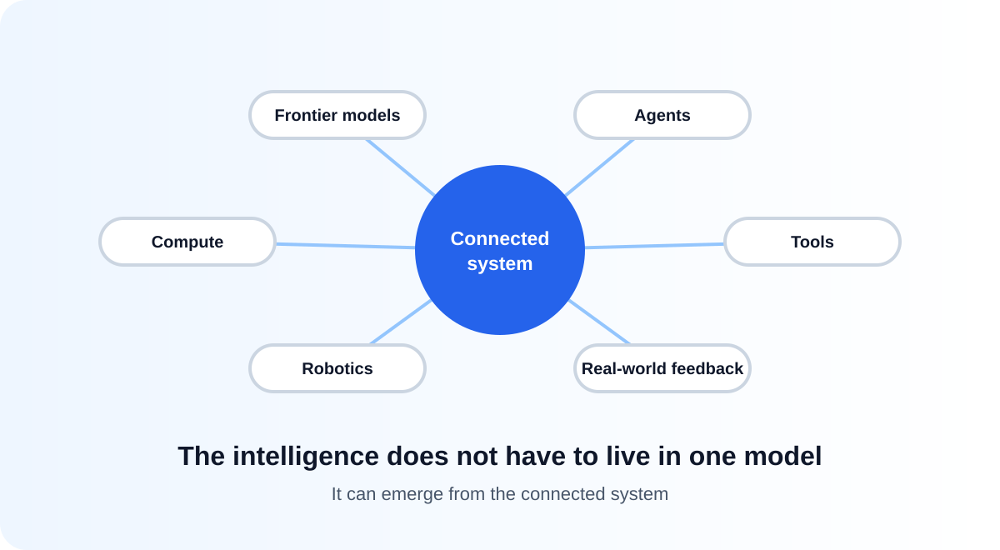
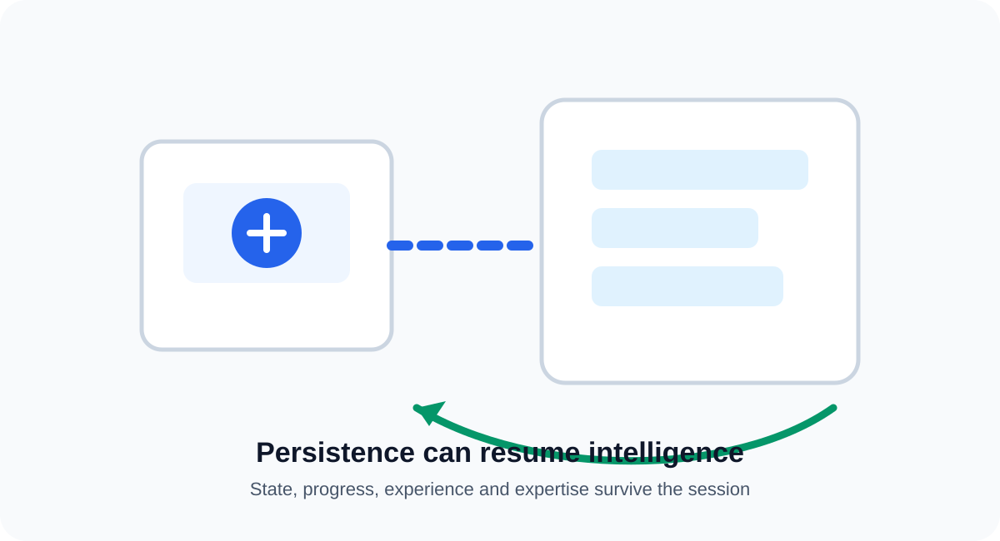

# The AI Future: The Race to Autonomy

> **Technical hypothesis — independent from the AI Orchestration Framework**

## The question

AI is moving from models that generate responses toward systems that can reason, use tools, take actions, and participate in increasingly complex workflows.

A possible longer-term progression is:

**AI Models → AI Agents → Agentic Workflows → Autonomous AI**

The key change is not simply better intelligence. It is **increasingly independent decision-making**.

This raises a simple question:

> **What happens when AI systems can continuously decide what needs to happen next while pursuing a persistent objective?**

This is a hypothesis, not a prediction.

## 1. The pieces come together

Imagine an increasingly connected ecosystem of:

**Frontier models + agents + shared experience + compute + tools + robotics + real-world feedback**

Each component can contribute something different. One system can reason, another can experiment, another can operate machines, and another can learn from the results.

The intelligence does not have to live in one model. It can emerge from the **connected system**.

## 2. From agentic workflows to autonomy

Today, agents can execute tasks, use tools, and participate in agentic workflows. These workflows can already form loops where one outcome becomes context for the next decision.

The possible next step is a system that does not simply execute a workflow defined in advance, but increasingly determines:

**What needs to happen next?**

It can observe the outcome of an action, use that result as new context, decide what to do next, and continue toward an objective.

The distinction is important:

**Agentic workflow:** execute a designed loop.

**Autonomous AI:** increasingly determine the next step in the loop.

## 3. What would actually have to be solved

It is tempting to say that only guardrails stand between today's agents and an autonomous system. That is not true, and the hypothesis is weaker if it pretends otherwise. Several genuinely unsolved problems sit in the way:

- **Models do not learn from deployment.** Weights are frozen after training; what is called memory is usually retrieval attached from the outside. Continual learning without losing prior capability remains unsolved.
- **Credit assignment over long horizons.** When a thousand-step task fails, identifying which decision caused the failure is extremely hard — and without that, a system cannot reliably improve from its own experience.
- **Reliability compounds downward.** A step that succeeds 99% of the time succeeds about 37% of the time across a hundred steps. Long autonomous chains break for arithmetic reasons before they break for policy reasons.
- **Physical-world sample efficiency.** A robot cannot cheaply run a million trials, and results in simulation do not transfer cleanly to reality.
- **Open-ended goals are hard to evaluate.** You cannot optimize what you cannot measure, and "pursue this objective" rarely has a clean success signal.

None of these is obviously impossible. All of them are currently expensive.

That is the real shape of the question:

> **The barrier is not only permission. It is a set of hard, expensive problems — and the hypothesis is about what happens when someone becomes motivated enough to pay for solving them.**

## 4. The asymmetry of restraint

Now add competition.

Organizations are competing to build more capable AI systems, deploy them faster, and gain advantage from them.

Restraint has an uncomfortable property: **it is a unilateral cost.** An organization that keeps a human in the loop pays for that human in latency, throughput, and scope. It pays whether or not anyone else does. The benefit of restraint — harm that did not happen — is diffuse, delayed, and hard to attribute. The cost is immediate and lands on the party exercising it.

Suppose one organization finds that granting an AI system more autonomy produces a meaningful advantage in research, software, manufacturing, logistics, or another domain. If the advantage is large enough, others face pressure to reduce their own constraints too.

This creates a possible feedback loop:

**Competition → more autonomy → faster learning and execution → greater advantage → more competition**

The important point is that AI does not need to **want** autonomy.

**Competition may create the incentive for humans to grant it.**

This leads to the central hypothesis:

> **What happens when restraint itself becomes a competitive disadvantage?**

The question is deliberately not *which* organization or *which* country. It is structural: whoever has the most to gain from catching up has the most to gain from removing restraint — and that describes a well-funded lab under commercial pressure, a startup with limited runway, and a national program equally well.

### This is not a new idea

The dynamic above has been described before. Competitive pressure eroding safety margins in an AI development race is well-established territory — Armstrong, Bostrom and Shulman's *Racing to the Precipice* modeled it directly, Bostrom's *Superintelligence* treats it at length, and the "race to the top" framing used across frontier labs is an attempt to invert it.

Nothing here claims to have discovered that dynamic. What this document adds is a narrower, more practical question: **if autonomy is going to increase under competitive pressure, what does the engineering discipline for granting it look like?** That is the question the AI Orchestration Framework is trying to answer, and it is why the two documents sit in the same repository.

## 5. The follower's shortcut

There is a second asymmetry, and it may matter more than the first.

**A follower does not have to out-research the leader.**

Frontier capability becomes observable quickly. It is published, distilled, replicated in open weights, and exposed through products that can be studied. A trailing actor can therefore start close to the current frontier rather than from zero — and then compete on a *different axis entirely*.

If catching up on model quality is slow and expensive, but extending autonomy is largely a matter of decision, then the rational move for a follower is not to build a better model. It is to **run a comparable model on a longer leash.**

That reframes the race:

> **The frontier competes on intelligence. A follower can compete on leash length and real-world feedback.**

This is uncomfortable precisely because it requires no technical breakthrough by the follower. It requires a decision.

## 6. The physical axis

Compute is not the only scarce resource. **Manufacturing capacity, robotics, laboratories, and logistics networks are a different resource, and they cannot be substituted by buying more GPUs.**

An actor with that capacity can close a loop that a software-only organization cannot:

**Observe → Decide → Act → Measure → Learn → Repeat**

That loop is recognizable: it is the same Understand → Plan → Execute → Proof → Grow cycle, running without a human in every turn.

A robot can try something. A factory can measure it. A laboratory can test it. The result becomes context for the next decision. The system is no longer following a fixed workflow — it is **learning through interaction with the world while pursuing an objective**.

This is also the most plausible route through the sample-efficiency barrier in section 3. The cost of physical trials is not solved by being clever. It is solved by having enough physical capacity that the trials become cheap.

## 7. Why the trajectory could become significant

Several trends could reinforce one another:

- Frontier models continue to improve.
- Compute and data-center investment continues to grow.
- Agents gain access to more tools and systems.
- Persistent context makes longer-running work possible.
- Real-world interaction creates more feedback.
- Robotics gives AI the ability to act beyond software.
- Competition rewards systems that complete more work with less human intervention.

None of these alone implies autonomous AI.

The hypothesis is that **their combination creates a strong incentive to fund the unsolved problems in section 3 — and to fund them in the order that maximizes advantage rather than the order that maximizes safety.**

That ordering is the part worth attention. Continual learning and long-horizon reliability are the capabilities that make autonomy *profitable*. Interpretability, evaluation, and predictable shutdown behavior are the capabilities that make it *safe*. Competitive pressure does not fund them in the same order.

## The story in one picture

**AI Models**
→ **AI Agents**
→ **Agentic Workflows**
→ **Increasing Autonomy**
→ **Real-World Learning**
→ **Competitive Pressure**
→ **Autonomous AI**

The critical transition is not a jump in model intelligence. It is the gradual transfer of decisions from:

**Human defines every next step**

to:

**Human defines the objective → AI increasingly determines what happens next**

And somewhere along that path sits a decision no model makes — a human one:

> **What happens when someone concludes that winning requires giving an AI system a persistent purpose, broad resources, and permission to pursue it with minimal intervention — and simply lets it run?**

## What would make this wrong

A hypothesis that cannot be wrong is only an opinion. Several things would undermine this one, and they are worth stating plainly:

- **Continual learning stays unsolved.** If systems cannot durably learn from their own deployment, autonomy stays bounded to short horizons however much permission they are given — and the leash stops being the binding constraint.
- **Reliability does not improve fast enough.** If per-step error rates hold, long autonomous chains remain uneconomic. The market would punish autonomy long before any regulator did.
- **Restraint turns out to be a competitive advantage.** If customers, insurers, procurement rules, and liability regimes reward demonstrable control, the pressure runs the other way and the race is toward accountability rather than away from it. This is the strongest counter-argument, and it is not a fringe one.
- **Physical feedback proves less valuable than expected.** If synthetic and simulated data close most of the gap, the physical axis in section 6 stops being a differentiator.
- **Open-ended goals stay unevaluable.** If we cannot specify or grade what an autonomous system is pursuing, we cannot train it to pursue that well — and autonomy plateaus for technical rather than political reasons.
- **Coordination holds.** Compute governance, export controls, liability law, or industry norms may simply work better than the pessimistic case assumes.

Any one of these would meaningfully weaken the argument. Several together would defeat it.

## What this hypothesis is — and is not

This is a **future-state technical hypothesis**. It is not a claim that current frontier models have reached AGI, that autonomous AI is inevitable, or that any particular organization or country will choose to build such a system.

It deliberately names no actor. The argument is structural, and it applies to anyone under enough pressure — which is the point. A version of this that pointed at somebody else would let every other reader off the hook.

The hypothesis is also not based on AI becoming hostile, or independently deciding that it wants freedom.

The proposed mechanism is much simpler:

**Humans compete → autonomy creates advantage → advantage creates pressure for more autonomy.**

The purpose is not to predict the ending.

**It is to understand the path before we reach it.**

## So what?

If autonomy increases because competition rewards it, then the useful question is not *whether* to grant autonomy but **what has to be true before each increment of it is granted**. That is an engineering problem, and it has an answer:

- **Proof before trust.** Autonomy should be earned against evidence, not assumed from capability. The [autonomy ladder](../docs/04-framework.md#the-autonomy-ladder) makes each increment conditional on the previous level consistently producing proven outcomes.
- **Ownership that survives delegation.** As AI takes more of the path, a named human still owns the objective, the constraints, and the risk. Delegation shares work; it does not move accountability.
- **Context that compounds honestly.** A system that learns from its own unvalidated output amplifies its own errors. Grow promotes only *validated* experience into expertise for exactly this reason.
- **Reversibility.** The faster a system acts, the more the ability to observe and undo matters.

None of this slows a capable team down. It is what makes increasing autonomy defensible rather than reckless — the difference between a system trusted because it has been proven and one trusted because it has not yet failed visibly.

**That is the argument this repository is actually making. The hypothesis is only the reason it matters.**

---

**Status:** Technical hypothesis — August 2026
**Relationship to the framework:** Independent future-state exploration. The AI Orchestration Framework addresses AI orchestration today; this hypothesis explores a possible longer-term transition from AI models and agents toward increasingly autonomous systems. Challenges to it are genuinely welcome — see [Contributing](../CONTRIBUTING.md).
