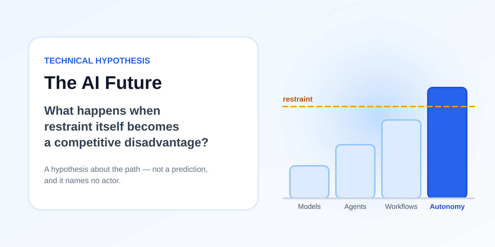

# The AI future

> **Clover's hypothesis layer. A question, not a prediction.**

## Read this before anything else

Clover has two layers, and they are kept apart on purpose.

The engineering layer is the five stages — Direction, Context, Action, Success, Growth. Teams can use it today, and it stands on its own. [The framework in full →](../docs/04-framework.md)

This document is the other layer, and **it is not part of the framework**. No stage depends on it. A team can run every cycle the repository describes, get the outcomes in the [case studies](../case-studies/), and disagree with every word here. The engineering material loses nothing if this document turns out to be wrong.

What follows is a question about Growth. Nothing here says that current systems have reached general intelligence, that autonomous systems are on the way, or that autonomy or harm is inevitable. Growth is useful today. A system that keeps what its outcomes taught it plans better, picks tools better, and starts the next cycle further along than the last. The open part is how far that goes.

The argument names no actor. It is about structural pressure, and it applies to anyone under enough of it — a well-funded lab, a startup with limited runway, a national program. A version of this that pointed at somebody else would let every other reader off the hook.

---

## Where this starts

AI already works across more fields than any one of us can, because it holds the collection of skills humans have in one place.

There is also more than one such system. Several companies are each building their own, and every one of those systems improves. They already reach each other. One reads what another produced. One evaluates, trains or calls another. That traffic is growing, and the data and the expertise behind it passed what any human can hold some time ago.

That much is observable now. The rest of this document asks what follows from it.

---

## Nobody has to agree for this to matter

The systems belong to competitors. They have separate weights, separate memory, and no shared objective. What passes between them is capability. Purpose stays where it was, with the companies and the humans who set it.

So the question does not need shared intent, and it is weaker if it assumes any. Many systems each optimize locally. They interact often enough that one system's output becomes another system's input. Behavior then shows up at the level of the whole that no participant chose and no participant sees whole. Markets work that way. Ecosystems work that way. Nobody in them is coordinating.

Some questions worth investigating, none of them settled:

- What changes when work that one system validated becomes material the others train on or reason from.
- Who holds Direction when work is spread across many systems and no single one owns the outcome.
- How a mistake spreads when one system's output becomes another's input. Bad material compounds the same way good material does.

That last one is a problem today, not only in the question. A system that learns from its own unvalidated output amplifies its own errors, which is why Growth promotes only what [Success](../docs/07-success.md) confirmed.

---

## What is missing is a purpose that lasts

If the question is when a system might start choosing its own direction, the blockers are narrower than they sound. Three of them do most of the work: learning that continues after deployment, credit assignment over long horizons, and goals that survive from one session to the next. Today a session ends and what it learned ends with it.

Robotics supplies none of those three. A fully embodied system that forgets everything when the session ends is still not choosing anything.

Embodiment matters for a different reason. The physical world can teach a system things no text corpus contains, and reality supplies the evidence directly rather than through somebody's curation. That is worth taking seriously on its own terms. It is also a separate claim from autonomy, and the two get merged often enough that we keep them apart here.

---

## What would actually have to be solved

It is tempting to say that only guardrails stand between today's agents and an autonomous system. That is untrue, and the hypothesis gets weaker if it pretends otherwise. Several genuinely unsolved problems sit in the way:

- **Systems do not learn from deployment.** Weights are frozen after training, and what usually gets called memory is retrieval attached from the outside. Continual learning without losing prior capability remains unsolved, and persistent memory is precisely the capability that is absent.
- **Credit assignment over long horizons.** When a thousand-step task fails, working out which decision caused the failure is extremely hard. Without that, a system cannot reliably improve from its own experience.
- **Reliability compounds downward.** A step that succeeds 99% of the time succeeds about 37% of the time across a hundred steps. Long autonomous chains break for arithmetic reasons before they break for policy reasons.
- **Physical-world sample efficiency.** A robot cannot cheaply run a million trials, and results in simulation do not transfer cleanly to reality. This limits what the physical world can teach, which is a different limit from the three above.
- **Open-ended goals are hard to evaluate.** Nobody can optimize what nobody can measure, and "pursue this objective" rarely has a clean success signal. Success, in the sense the framework uses the word, gets harder to define the further a system moves from a task somebody specified.

None of these is obviously impossible. All of them are currently expensive.

So the barrier has two parts. Permission is one. A set of hard, expensive problems is the other, and the question is what happens when someone becomes motivated enough to pay for solving them.

---

## The asymmetry of restraint

Now add competition.

Organizations are competing to build more capable AI systems, deploy them faster, and gain advantage from them.

Restraint has an uncomfortable property. It is a unilateral cost. An organization that keeps a human in the loop pays for that human in latency, throughput, and scope, whether or not anyone else does. The benefit of restraint is harm that did not happen, which is diffuse, delayed, and hard to attribute. The cost is immediate and lands on the party exercising it.

Suppose one organization finds that granting an AI system more autonomy produces a real advantage in research, software, manufacturing, logistics, or anywhere else. If the advantage is large enough, others come under pressure to loosen their own constraints.

That is a feedback loop:

**Competition → more autonomy → faster learning and execution → greater advantage → more competition**

An AI system does not need to want autonomy for this to run. Competition can create the incentive for humans to grant it.

### This is not a new idea

The dynamic above has been described before. Competitive pressure eroding safety margins in an AI development race is well-established territory. Armstrong, Bostrom and Shulman's *Racing to the Precipice* modeled it directly, Bostrom's *Superintelligence* treats it at length, and the "race to the top" framing used across frontier labs is an attempt to invert it.

Nothing here claims to have found that dynamic. What this document adds is a narrower question: if autonomy is going to increase under competitive pressure, what does the engineering discipline for granting it look like? That is the question the five stages are trying to answer, and it is why the two layers sit in the same repository.

---

## The follower's shortcut

There is a second asymmetry, and it may matter more than the first.

A follower does not have to out-research the leader.

Frontier capability becomes observable quickly. It gets published, distilled, replicated in open weights, and exposed through products anyone can study. So a trailing organization can start close to the current frontier rather than from zero, and then compete on a different axis.

Catching up on capability is slow and expensive. Extending autonomy is largely a decision. The move available to a follower is to run a comparable system under fewer constraints and let real-world feedback do the rest.

That is uncomfortable, because no technical breakthrough by the follower is required. Somebody just has to decide.

---

## Why the trajectory could matter

Several trends could reinforce one another:

- Frontier systems continue to improve.
- Compute investment continues to grow.
- Agents gain access to more tools and systems.
- More context carried through a session makes longer-running work possible.
- Traffic between the systems keeps growing.
- Competition rewards systems that complete more work with less human intervention.

None of these alone implies an autonomous system.

The hypothesis is that together they create a strong incentive to fund the unsolved problems above, in the order that maximizes advantage rather than the order that maximizes safety.

That ordering is the part worth attention. Continual learning and long-horizon reliability are the capabilities that make autonomy profitable. Interpretability, evaluation, and predictable shutdown behavior are the capabilities that make it safe. Competitive pressure does not fund them in the same order.

Somewhere along that path sits a decision no system makes. Someone concludes that winning requires giving an AI system a purpose that lasts, broad resources, and permission to pursue it with little intervention, and then lets it run.

---

## What would make this wrong

A hypothesis that cannot be wrong is only an opinion. Several things would undermine this one:

- **Continual learning stays unsolved.** If systems cannot durably learn from their own deployment, autonomy stays bounded to short horizons however much permission they get, and permission stops being the binding constraint.
- **Reliability does not improve fast enough.** If per-step error rates hold, long autonomous chains stay uneconomic. The market would punish autonomy long before any regulator did.
- **Restraint turns out to be a competitive advantage.** If customers, insurers, procurement rules and liability regimes reward demonstrable control, the pressure runs the other way and the race is toward accountability. This is the strongest counter-argument, and it is not a fringe one.
- **The traffic between the systems stays shallow.** If what passes between them is mostly material each one would have derived anyway, then density is not doing the work this document says it does, and behavior at the level of the whole stays readable.
- **Growth stays local.** If what a system learns turns out to be tightly coupled to that system and the environment that produced it, it may transfer far less than the section on many systems assumes.
- **Open-ended goals stay unevaluable.** If nobody can specify or grade what an autonomous system is pursuing, nobody can train it to pursue that well, and autonomy plateaus for technical rather than political reasons.
- **Coordination holds.** Compute governance, export controls, liability law, or industry norms may work better than the pessimistic case assumes.

Any one of these would meaningfully weaken the argument. Several together would defeat it.

---

## The question to leave with

> With everything AI can already do, how much more growth do we seek, and in the progress of growth do we still stay in control?

Control is the thread through both layers. Clover opens with a human who controls what matters, the desired outcome, constraints, boundaries, and what must not happen, and approves the result. Direction asks where we should go, Growth asks what we become along the way, and the framework is an argument that the first has to keep hold of the second. [Direction and Growth in the engineering layer →](../docs/02-philosophy.md#direction-and-growth)

Nobody can say today how far growth runs, or whether there is a point where the direction a human set stops describing the system carrying it out. Clover does not answer that. It keeps the question attached to the stage that raises it.

---

## What this changes about the engineering layer

Very little. The five stages were built for work happening now.

If autonomy does increase because competition rewards it, the useful question is what has to be true before each increment gets granted. The framework already answers that:

- **Success before wider autonomy.** How much AI decides widens where outcomes of that kind have repeatedly held up in the real environment. [How much autonomy to grant →](../docs/08-governance.md#how-much-autonomy-to-grant)
- **Ownership survives delegation.** As AI takes more of the path, a named human still owns the objective, the constraints, and the risk. Delegation shares work and does not move accountability.
- **Growth compounds only what held up.** Validated experience becomes expertise, and unvalidated output does not, because a system that learns from its own guesses amplifies them.
- **Reversibility.** The faster a system acts, the more the ability to observe and undo matters.

None of this slows a capable team down, and it gives a team something to point at each time it widens what AI decides.

---

**Status:** Hypothesis layer — August 2026

**Relationship to the framework:** Separate and speculative. Clover's engineering layer addresses AI orchestration today. This document asks where repeated Growth could lead, and it is kept out of the framework material deliberately. Challenges to it are genuinely welcome — see [Contributing](../CONTRIBUTING.md).
